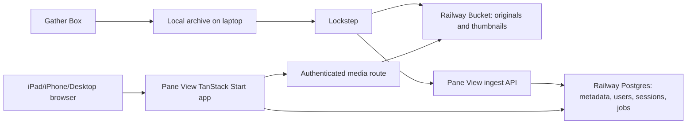

# Latch Works Architecture Plan

Last updated: 2026-06-02

## 1. Goal

Build a private, read-only web media viewer named Pane View that feels like the existing Frame View desktop app, works well on iPad/iPhone, and lives in a new monorepo named Latch Works together with:

- Frame View, the Electron desktop gallery viewer: `C:\Users\Trayd\dev\frame-view`
- Gather Box, the Chrome extension currently living at `C:\Users\Trayd\dev\comic-downloader`
- Pane View, a new TanStack Start web viewer
- Shared media/domain packages used by more than one app
- Lockstep, a sync/ingest CLI for publishing the local archive to the deployed Pane View app

The laptop remains the practical source of truth at first. Tresorit remains backup/sync infrastructure. Pane View receives explicit uploads/syncs from the local archive rather than trying to mirror Tresorit mobile behavior.

## 2. Naming Map

- `latch-works`: the overall monorepo.
- `pane-view`: the TanStack Start web viewer.
- `lockstep`: the local archive sync/ingest CLI.
- `gather-box`: the Chrome extension currently living in `C:\Users\Trayd\dev\comic-downloader`.
- `frame-view`: the existing Electron desktop viewer.

## 3. Current Project Inventory

### Frame View

Observed from `C:\Users\Trayd\dev\frame-view`.

Frame View is a private Electron Forge + Vite + React + TypeScript app with pnpm, Biome, Vitest, Knip, Tailwind, Drizzle, better-result, sharp, ffmpeg/ffprobe, and Zustand. Its current feature set is the north star for Pane View:

- Mixed image and video gallery.
- Virtualized large-folder rendering.
- Fullscreen-style viewer modal.
- Video play/pause, seek, skip, volume, speed, and temporary speed boost.
- Recursive folder scanning.
- Folder navigation and folder overlay.
- Comic mode, where image folders become comic entries.
- Sort modes: name, date, random.
- Thumbnail cache and SQLite media index.
- Persistent settings.
- Keyboard-first navigation.

Reusable areas:

- Shared contracts in `src/shared/contracts.ts`.
- Media item/settings types in `src/shared/types.ts`.
- Sort/comic grouping utilities in `src/renderer/utils`.
- Browser-entry construction and navigation model ideas.
- Viewer/comic/grid components, after removing Electron-only assumptions.
- Thumbnail generation concepts, possibly workerized again on the server/CLI.

Electron-specific areas that should not be shared directly:

- Native folder picker, reveal-in-folder, desktop menu, preload bridge.
- Local filesystem media URLs.
- SQLite paths and OS-level cache paths.
- Electron IPC contracts.

### Gather Box

Observed from `C:\Users\Trayd\dev\comic-downloader`.

Gather Box is the target name for the existing private TypeScript Chrome extension currently called Content Downloader and built with esbuild. It downloads image galleries and story PDFs from supported pages into inferred local folder structures. It already contains useful source-site and path inference code.

Reusable areas:

- Site detection and content-source types.
- Path normalization and inferred folder naming rules.
- Story/PDF naming rules.
- Future metadata capture, if the extension starts writing sidecar manifests.

Likely future change:

- After Latch Works exists, Gather Box should optionally write a small sidecar manifest per downloaded post/story. That gives Pane View richer grouping and search without scraping filenames later.

## 4. Product Scope

### Must Have

- Authenticated private web access.
- Read-only browsing.
- Responsive desktop/tablet/mobile layout.
- Folder-tree or folder-overlay navigation.
- Recursive media browsing.
- Comic grouping and comic reader.
- Image, animated image/GIF, video, and PDF/story support.
- Fast thumbnail grid.
- Fullscreen media viewer.
- Video controls comparable to Frame View.
- Sorting and random/shuffle behavior.
- Lockstep sync command from local archive to deployed storage.
- Deployment to Railway.

### Should Have

- PWA installability for iPad/iPhone.
- Resume position for videos and PDFs per user/device.
- Favorites/bookmarks/read state.
- Search by path/name/type/source.
- Duplicate detection by hash.
- Thumbnail/previews for PDFs and videos.
- Background ingest jobs for metadata extraction.

### Explicitly Out of Scope for First Version

- Editing/deleting remote archive files from the web UI.
- Public sharing.
- Multi-user collaboration.
- Full mobile offline sync.
- Replacing Tresorit as the laptop backup system.

## 5. Recommended Architecture

Use a server-backed private object-store model:



Core idea:

- Store large binary media in a private Railway Bucket.
- Store metadata, auth, sessions, sync history, derived grouping, and reading state in Postgres.
- Use TanStack Start for Pane View, route loaders, server functions, and server routes.
- Use short-lived signed object URLs or authenticated proxy routes for media delivery.
- Use Lockstep to upload media and update metadata.

This is a better first foundation than Railway Volumes for the primary archive. Railway Volumes are useful, but the current Railway docs list meaningful caveats: default plan sizes, one volume per service, no built-in SFTP/file browser, no replicas with volumes, and downtime implications when a volume is attached during deploys. Railway Buckets are private S3-compatible object storage and fit large read-mostly media better.

## 6. Railway Platform Notes

Based on current Railway docs:

- Railway services are long-running app/API processes. Source builds use Railpack or a Dockerfile if present.
- Railway has persistent Volumes, but they are mounted at runtime, not build time.
- Volume default sizes are plan-dependent, and Pro can self-serve up to 250 GB.
- Volumes are good for SQLite/cache-like local persistence, but not ideal as the main archive.
- Railway Buckets are private S3-compatible object storage.
- Private bucket objects can be served through presigned URLs or through a backend proxy.
- Railway does not currently provide a built-in CDN for static hosting; Cloudflare is the natural CDN/custom-domain layer if global edge caching becomes important.
- Railway Cron Jobs can run scheduled tasks and must exit after completion; minimum frequency is 5 minutes and schedules are UTC.
- Postgres can be provisioned as a Railway database service and exposed to the app via variables/private networking.

Primary references:

- Railway Volumes: https://docs.railway.com/develop/volumes
- Railway Volumes reference: https://docs.railway.com/reference/volumes
- Railway Storage Buckets: https://docs.railway.com/guides/storage-buckets
- Railway Bucket guide: https://docs.railway.com/guides/storage-buckets-guide
- Railway deployments: https://docs.railway.com/deployments/reference
- Railway CLI deploy: https://docs.railway.com/cli/deploying
- Railway Dockerfiles: https://docs.railway.com/builds/dockerfiles
- Railway static hosting/CDN note: https://docs.railway.com/guides/static-hosting
- Railway Cron Jobs: https://docs.railway.com/reference/cron-jobs
- Railway Postgres: https://docs.railway.com/databases/postgresql/

## 7. Tresorit Position

Tresorit should remain backup/source-of-truth infrastructure for now, not a runtime dependency for Pane View.

Current Tresorit docs say the Tresorit API is S3-compatible, but it is in Early Adopter phase and runs locally in your infrastructure to preserve E2EE. It can work with S3-compatible tools such as rclone, MinIO, or AWS SDKs, but it is not a simple hosted API to build Pane View around today.

Plan:

1. First version syncs from the local folder on the laptop to Railway Bucket.
2. Later, if you get Tresorit API access, add a source adapter that reads from local Tresorit API/rclone and pushes to the same ingest pipeline.
3. Do not make the deployed app depend on decrypting Tresorit content in production unless you intentionally deploy and secure the Tresorit API bridge.

Reference:

- Tresorit API: https://support.tresorit.com/hc/en-us/articles/33971802915858-Tresorit-API
- Tresorit CLI: https://support.tresorit.com/hc/en-us/articles/360009330614-Using-Tresorit-CLI-for-Linux

## 8. Latch Works Monorepo Shape

Recommended structure:

```text
latch-works/
  apps/
    frame-view/              # imported existing Electron app
    gather-box/              # imported and renamed Chrome extension
    pane-view/               # new TanStack Start app
  packages/
    media-domain/            # shared schemas, media types, sort, comic grouping
    media-storage/           # S3/Railway Bucket client, key conventions
    media-index/             # scan/manifest/index logic, metadata extraction contracts
    media-ui/                # reusable React gallery/viewer/comic/PDF components
    auth/                    # session/auth helpers used by web only at first
    config/                  # tsconfig, biome, test config presets
  tools/
    lockstep/                # local archive -> bucket + ingest API
    migrate/                 # one-off import/reconcile scripts
  docs/
    architecture/
    runbooks/
    decisions/
```

Package responsibilities:

- `apps/pane-view`: TanStack Start web app, auth, route composition, server functions, server routes, Railway deployment.
- `apps/frame-view`: existing Electron app, gradually switched to shared packages.
- `apps/gather-box`: existing extension renamed from Content Downloader, gradually switched to shared source/path packages.
- `packages/media-domain`: Zod schemas, `MediaItem`, `MediaType`, filters, sort modes, comic grouping, extension detection, path normalization.
- `packages/media-ui`: React components that do not know whether media came from local files or HTTP URLs.
- `packages/media-storage`: S3-compatible storage operations, presigned URLs, object-key generation, multipart uploads.
- `packages/media-index`: manifests, scan results, hash/checksum logic, metadata extraction interfaces.
- `tools/lockstep`: publishes local content to Pane View.

Use pnpm workspaces because both existing projects already use pnpm. Keep TypeScript, Biome, Vitest, and Drizzle because Frame View already has these patterns.

## 9. Import Strategy for Existing Projects

Preferred import path:

1. Create the monorepo root config first.
2. Import `frame-view` under `apps/frame-view`.
3. Import `comic-downloader` under `apps/gather-box`, and update its package/app name to Gather Box.
4. Keep both apps working before extracting shared packages.
5. Extract shared packages incrementally.

History options:

- If preserving Git history matters, use `git subtree add --prefix=apps/frame-view <repo> <branch>` and same for Gather Box.
- If history does not matter, copy the working trees and keep the old repos archived until parity is proven.

Do not start by deeply refactoring Frame View. First make the monorepo boring and green.

## 10. Pane View Technical Plan

### Framework

Use TanStack Start React.

Current TanStack Start docs describe it as a full-stack framework powered by TanStack Router, with SSR, streaming, server functions/RPCs, server routes/API routes, middleware, and Vite bundling. That maps well to Pane View because most pages are interactive but the media APIs need server-only access to storage credentials.

References:

- TanStack Start React docs: https://tanstack.com/start/latest/docs/framework/react/
- TanStack Start server functions: https://tanstack.com/start/latest/docs/framework/react/guide/server-functions
- TanStack Start server routes: https://tanstack.com/start/latest/docs/framework/react/guide/server-routes
- TanStack Router data loading: https://tanstack.com/router/latest/docs/framework/react/guide/data-loading
- TanStack Query overview: https://tanstack.com/query/docs/docs

### TanStack Libraries

Use:

- TanStack Start for the Pane View app shell, server functions, server routes, SSR.
- TanStack Router for file routes, route loaders, search params, preloading.
- TanStack Query for server-state caching that is shared across routes: folders, media pages, search, progress.
- TanStack Virtual for gallery grid virtualization and comic/PDF page virtualization.
- TanStack Form for login/settings forms if the ergonomics feel good during implementation.
- TanStack Store only if replacing Zustand becomes valuable. Frame View already uses Zustand, so do not force a state rewrite immediately.

### Routes

Suggested route map:

```text
/login
/logout
/
/library
/library/$folderId
/media/$mediaId
/comic/$collectionId
/story/$mediaId
/search
/settings
/api/media/$mediaId/original
/api/media/$mediaId/thumbnail
/api/media/$mediaId/download
/api/sync/runs
/api/sync/upload-url
/api/sync/complete-object
/api/health
```

Use route guards for page UX, but enforce auth in every protected server function and every media/server route.

## 11. Auth Plan

Because all content is private, auth is not optional infrastructure.

Recommended first version:

- Single-user or allowlisted-user auth.
- HTTP-only secure session cookies.
- Server-side session storage in Postgres.
- Password login with strong hashing, or passkey/OAuth if you prefer less password handling.
- CSRF protection for non-GET requests.
- Rate limiting for login and sync endpoints.
- API token for Lockstep, scoped only to ingest/upload.

TanStack's own auth docs stress that route guards do not protect server functions by themselves; server functions are RPC endpoints and need handler/middleware auth checks. Build around that from day one.

References:

- TanStack authentication overview: https://tanstack.com/start/v0/docs/framework/react/guide/authentication-overview
- TanStack authentication server primitives: https://tanstack.com/start/v0/docs/framework/react/guide/authentication-server-primitives
- TanStack server functions auth warning: https://tanstack.com/start/latest/docs/framework/react/guide/server-functions

Implementation notes:

- Use `__Host-` prefixed cookies in production.
- Set `HttpOnly`, `Secure`, `SameSite=Lax`, `Path=/`.
- Keep sessions revocable in Postgres.
- Never let storage bucket credentials reach the browser.
- Short-lived media URLs should be generated only after auth.
- For stricter privacy, proxy media through authenticated server routes instead of issuing presigned URLs. For better video/range performance, use short-lived signed URLs.

## 12. Storage and Media Delivery

### Object Keys

Use content-addressed object storage with logical path metadata:

```text
originals/sha256/ab/cd/<sha256>.<ext>
thumbnails/sha256/ab/cd/<sha256>-<size>.webp
previews/video/sha256/ab/cd/<sha256>-poster.webp
previews/pdf/sha256/ab/cd/<sha256>-cover.webp
```

Why:

- Renames and folder moves do not require reuploading binaries.
- Duplicate files are naturally deduped.
- The database owns display paths and folder grouping.
- Sync can compare hashes and sizes reliably.

Keep a human-readable manifest so the archive is not trapped in the database:

```text
manifests/sync-runs/<syncRunId>.jsonl
```

### Delivery Modes

Mode A, recommended default:

- Authenticated server route checks permission.
- Route returns a short-lived signed URL or redirects to it.
- Browser/video/PDF viewer loads directly from object storage.
- Best for video range requests and large files.

Mode B, stricter privacy:

- Authenticated server route proxies bytes from bucket.
- Must implement `Range` support for video and PDF.
- More app CPU/egress pressure, but no temporary bearer URL leaves the app.

Decision: start with Mode A for originals and Mode A or B for thumbnails depending on ease. Keep Mode B as a hardening option for especially sensitive libraries.

### Supported Media

- Images: native browser `img` for JPEG, PNG, WebP, GIF, AVIF where supported.
- GIF/animated image: native `img`, with thumbnail extraction optional later.
- Videos: native `video`, with metadata from ffprobe during ingest.
- PDFs/stories: PDF.js based reader with virtualized pages, text search later.

Use feature detection for browser support. iOS Safari compatibility should be tested with real files. If a meaningful amount of the archive uses unsupported formats/codecs, add an offline transcode job that generates web-compatible MP4/HLS previews while retaining originals.

## 13. Database Model Draft

Use Postgres on Railway with Drizzle.

Core tables:

- `users`: id, email, password hash or provider identity, role, created at.
- `sessions`: id, user id, token hash, expires at, created at, revoked at.
- `api_tokens`: id, token hash, name, scopes, last used at, revoked at.
- `media_objects`: id, sha256, size, content type, extension, media type, width, height, duration, page count, object key, created at.
- `library_entries`: id, media object id, logical path, parent path, filename, mtime, source, source id, deleted marker, first seen, last seen.
- `folders`: id, path, parent path, name, entry count, updated at.
- `collections`: id, type (`comic`, `story-series`, `folder`, `source-post`), name, path, cover media id.
- `collection_items`: collection id, library entry id, position.
- `thumbnails`: media object id, size, object key, width, height, status.
- `sync_runs`: id, started at, completed at, source root, status, counts, manifest key.
- `sync_run_items`: sync run id, logical path, media object id, action, error.
- `viewer_state`: user id, media id or collection id, position, page, updated at.
- `favorites`: user id, entry/collection id, created at.

The first MVP can omit `favorites`, `viewer_state`, and some collection richness, but the schema should not block them.

## 14. Lockstep Sync CLI Plan

Lockstep is the bridge from laptop archive to Pane View.

Suggested commands:

```powershell
pnpm lockstep plan --source "D:\Archive" --remote production
pnpm lockstep push --source "D:\Archive" --remote production
pnpm lockstep verify --source "D:\Archive" --remote production
pnpm lockstep prune --source "D:\Archive" --remote production --dry-run
```

Responsibilities:

- Walk local archive recursively.
- Apply the same supported extension rules as Pane View.
- Hash files, with local cache keyed by path + mtime + size.
- Detect new, changed, renamed, moved, missing files.
- Upload originals to Railway Bucket, preferably using presigned multipart upload for large videos.
- Send metadata to the ingest API.
- Generate or request thumbnails/previews.
- Write a JSONL manifest per sync run.
- Never delete remote objects by default. Prune should be explicit and dry-run first.

Authentication:

- CLI uses an API token stored locally outside the repo.
- Token scope: `sync:write`.
- Web browsing sessions use cookie auth and cannot automatically call sync endpoints.

Implementation choices:

- Use Node.js/TypeScript so it can share packages.
- Use AWS SDK S3 client because Railway Buckets are S3-compatible.
- Use ffprobe/ffmpeg and sharp locally where possible. Local metadata generation reduces server load.
- Keep a `.frame-web-sync-cache.sqlite` outside the archive or in an ignored tool cache directory.

## 15. Ingest Pipeline

Initial synchronous path:

1. CLI scans file.
2. CLI asks web API for upload target.
3. CLI uploads original to bucket.
4. CLI posts object metadata and logical path.
5. Pane View upserts DB rows.
6. CLI posts sync complete.

Later background path:

1. CLI uploads originals and basic metadata.
2. DB marks entries as needing derived metadata.
3. Railway worker or cron job generates thumbnails, PDF covers, video posters, and compatibility previews.
4. UI shows partial data while jobs complete.

For first implementation, do as much as possible locally in the CLI. It is cheaper, easier to debug, and uses the laptop where the media already exists.

## 16. Pane View UX Plan

Frame View parity should guide Pane View's UX, but mobile needs different ergonomics.

Desktop/tablet:

- App shell with compact top status bar.
- Folder/grid area as the primary view.
- Bottom or side tool strip for sort, recursive/comic mode, refresh, settings.
- Keyboard navigation similar to Frame View.
- Viewer overlay with previous/next, close, metadata, video controls.

iPad/iPhone:

- Touch-first grid.
- Sticky compact toolbar.
- Swipe left/right in viewer.
- Tap to show/hide controls.
- Larger hit targets for play, seek, previous/next.
- Avoid hover-only controls.
- Use browser fullscreen/PWA display where practical.

PDF/story:

- Route to a story reader instead of treating PDFs as generic downloads.
- Render with PDF.js.
- Support page thumbnails later.
- Track last page later.

Comic reader:

- Folder-derived comic entries first.
- Vertical scroll mode for mobile.
- Single-page or fit-to-width mode later.
- Preserve natural filename order using numeric collation, as Frame View already does.

## 17. Extraction Plan from Frame View

Extract in this order:

1. `media-domain`: media types, supported extensions, sort modes, schemas.
2. Comic grouping: `buildComicEntries`, numeric filename sort, folder base-name display.
3. Browser entry model: folders, media, comics as one selection/navigation list.
4. Pure UI pieces: media tile, comic tile, gallery grid, viewer controls.
5. Settings model: only settings shared by desktop and web.
6. Thumbnail interfaces, not implementation.

Keep Electron's runtime services in `apps/frame-view`. Pane View will use HTTP/server functions instead of IPC.

## 18. Gather Box Evolution

First consolidation:

- Move current extension into `apps/gather-box`.
- Rename the package/app surface from Content Downloader to Gather Box.
- Preserve existing behavior and build output.
- Share path/site types from a package only after tests are in place.

Later enhancement:

- Write optional sidecar metadata when saving downloads:

```json
{
  "source": "supported-site-key",
  "sourceUrl": "https://example.invalid/post/123",
  "title": "Post title",
  "creator": "Creator",
  "downloadedAt": "2026-06-02T00:00:00.000Z",
  "files": [
    { "path": "001.webp", "index": 1, "originalUrl": "https://example.invalid/file.webp" }
  ]
}
```

- Lockstep reads these manifests and creates richer collections.

## 19. Deployment Plan on Railway

Services:

- `pane-view`: TanStack Start Node service.
- `postgres`: Railway Postgres.
- `bucket`: Railway Bucket for originals/thumbnails/manifests.
- Optional `worker`: derived metadata generation.
- Optional `cron`: consistency checks, cache cleanup, backfill jobs.

Web service:

- Build from Latch Works with service root `apps/pane-view`, or use a root Dockerfile that builds only Pane View and needed packages.
- Set `PORT` according to Railway runtime.
- Add `/api/health`.
- Configure environment variables:
  - `DATABASE_URL`
  - `SESSION_SECRET`
  - `APP_ORIGIN`
  - `S3_ENDPOINT`
  - `S3_REGION`
  - `S3_BUCKET`
  - `S3_ACCESS_KEY_ID`
  - `S3_SECRET_ACCESS_KEY`
  - `MEDIA_URL_MODE=signed-url`

Storage:

- Bucket credentials live only in Railway variables.
- Public bucket access stays disabled.
- Original media objects are not committed to Git.

Networking:

- Use Railway-provided domain for early testing.
- Add custom domain later.
- Put Cloudflare in front later if CDN behavior matters.

Backups:

- Railway Postgres backups for metadata.
- Bucket remains the deployed media copy.
- Tresorit/local archive remains the independent backup/source of truth.
- Periodically export DB metadata manifests back to bucket/local machine.

## 20. Security Checklist

- Auth middleware on every protected server function.
- Auth checks on every media route.
- No bucket credentials in client bundles.
- API token hashing, scopes, rotation, last-used tracking.
- CSRF middleware for non-GET requests.
- Rate limit login and sync endpoints.
- Audit log for sync runs and login attempts.
- Short TTL for signed media URLs.
- `Cache-Control: private` for authenticated HTML/API responses.
- Validate all server-function inputs with Zod.
- Never trust client-provided object keys without DB ownership checks.
- Avoid path traversal by treating logical paths as metadata, not filesystem paths.
- Store local absolute paths only in local sync cache, not in the deployed DB, unless intentionally enabled.

## 21. Testing and Verification

Unit tests:

- Extension detection.
- Path normalization.
- Comic grouping.
- Sort modes.
- Object-key generation.
- Auth/session helpers.
- Sync diff planning.

Integration tests:

- Upload/ingest one image, one GIF, one video, one PDF.
- Authenticated media URL issuance.
- Unauthorized media requests fail.
- Recursive folder listing.
- Collection generation.

Browser tests:

- Desktop gallery keyboard navigation.
- iPad/mobile viewport grid layout.
- Viewer next/previous.
- Video play/pause/seek/range behavior.
- PDF reader opens and scrolls.

Manual media fixture:

Create a tiny local fixture archive in the repo or ignored test data with:

- Nested image folder.
- Comic folder with numbered pages.
- Short MP4.
- GIF.
- Small PDF.
- Filename edge cases.

## 22. Implementation Phases

### Phase 0: Decisions and Inventory

- Measure total archive size and monthly growth.
- Confirm expected Railway plan and storage budget.
- Confirm single-user vs multi-user.
- Confirm whether signed URLs are acceptable for originals.
- Create sample fixture archive.

### Phase 1: Latch Works Bootstrap

- Add pnpm workspace.
- Add shared TypeScript/Biome/Vitest config.
- Import Frame View and Gather Box under `apps/`.
- Ensure both apps still install, typecheck, test, and build.

### Phase 2: Shared Domain Package

- Extract media schemas/types/sort/comic grouping.
- Point Frame View at the package.
- Add focused tests.

### Phase 3: Pane View Prototype

- Create Pane View as a TanStack Start app.
- Build local fixture-backed gallery first.
- Port the Frame View visual/navigation model.
- Add responsive viewer, comic reader, and PDF reader skeleton.

### Phase 4: Auth and Database

- Add Drizzle/Postgres schema.
- Add login/session flow.
- Add protected routes and protected server functions.
- Add healthcheck.

### Phase 5: Storage and Sync MVP

- Add Railway Bucket client package.
- Add Lockstep plan/push/verify.
- Upload originals and thumbnails.
- Ingest metadata into Postgres.
- Serve media through authenticated signed URL routes.

### Phase 6: Railway Deployment

- Add Dockerfile or Railway config.
- Provision Postgres and Bucket.
- Deploy Pane View service.
- Run first private sync.
- Test from desktop, iPad, and iPhone.

### Phase 7: Feature Parity and Polish

- Improve mobile gestures.
- Add reading/video resume state.
- Add search.
- Add derived previews.
- Add source metadata from downloader sidecars.
- Add optional Cloudflare CDN/custom domain.

## 23. Open Questions

Answered in `docs/decisions/0001-phase-0-answers.md`.

1. Current archive size is 35.9 GB, with assumed growth of roughly 1 GB per month.
2. Pane View is strictly single-user.
3. Short-lived signed URLs are acceptable and should be the default media delivery mode.
4. iPad/iPhone offline access is out of scope for now; online-only is acceptable.
5. Pane View and Lockstep should preserve local-folder-like paths exactly as stored today.
6. Deleted local files should be removed remotely during sync, with deletions made visible in the Lockstep plan.
7. Folder/path browsing is the main mental model; source-site metadata can become useful later.
8. Web-compatible previews are acceptable for videos and oversized media.
9. Prototype storage can live fully on Railway.

## 24. Near-Term Next Step

Before writing application code, answer the Phase 0 questions that affect storage and auth. The most consequential decision is media delivery mode: signed URLs are simpler and better for mobile video performance, while proxying is stricter but heavier.

After that, scaffold Latch Works and import the two existing apps without refactoring them. The first green monorepo is the foundation; extraction and Pane View should come after that.
