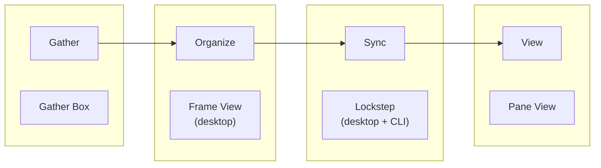

# Latch Works

> A private workshop for collecting, organizing, syncing, and viewing a personal media archive — across desktop, web, and the browser.

[](https://www.typescriptlang.org/)
[](https://pnpm.io/)
[](LICENSE)

Latch Works is a **pnpm monorepo** that brings together viewers, a collection tool, sync clients, shared media libraries, and a product site into one ecosystem. The local archive stays the source of truth; remote access is explicit, authenticated, and read-only.



---

## What's in the repo

| Name | Path | What it does |
| --- | --- | --- |
| **Pane View** | [`apps/pane-view`](apps/pane-view) | Private web viewer for browsing a synced archive on desktop, tablet, and phone. TanStack Start + PostgreSQL + S3. |
| **Frame View** | [`apps/frame-view`](apps/frame-view) | Cross-platform **Electron** desktop gallery for local images, videos, and comics. PDF reading is [planned](docs/plans/040-frame-view-pdf-spike.md), not shipped. The UX north star for Pane View. |
| **Gather Box** | [`apps/gather-box`](apps/gather-box) | **Chrome extension** that downloads image galleries and story PDFs from supported sites into inferred local folder structures. |
| **Lockstep** | [`apps/lockstep`](apps/lockstep) | **Electron** desktop sync client for planning and pushing archive changes to Pane View. Profiles, encrypted token storage, and run history. |
| **Lockstep CLI** | [`apps/lockstep-cli`](apps/lockstep-cli) | Scriptable sync tool (`plan`, `push`, `verify`, `doctor`) over the same engine as the desktop app. npm package `@latch-works/lockstep`. |
| **Showcase** | [`apps/showcase`](apps/showcase) | Astro marketing site and MDX docs for the ecosystem — product pages, screenshots, and getting-started guides. |

### Shared packages

| Package | Path | Role |
| --- | --- | --- |
| `@latch-works/media-domain` | [`packages/media-domain`](packages/media-domain) | Media types, path helpers, gallery sort/comic grouping, Zod schemas |
| `@latch-works/media-index` | [`packages/media-index`](packages/media-index) | Archive scanning and sync-plan generation |
| `@latch-works/media-storage` | [`packages/media-storage`](packages/media-storage) | Content-addressed S3 object key conventions and helpers |
| `@latch-works/lockstep-core` | [`packages/lockstep-core`](packages/lockstep-core) | Headless sync engine shared by Lockstep desktop and CLI |

---

## Workspace layout

```text
latch-works/
├── apps/
│   ├── pane-view/       # TanStack Start web viewer
│   ├── frame-view/      # Electron desktop viewer
│   ├── gather-box/      # Chrome extension
│   ├── lockstep/        # Electron desktop sync client
│   ├── lockstep-cli/    # Scriptable sync CLI
│   └── showcase/        # Astro product site and docs
├── packages/
│   ├── media-domain/
│   ├── media-index/
│   ├── media-storage/
│   └── lockstep-core/
└── docs/
    ├── ARCHITECTURE.md
    ├── decisions/
    ├── plans/
    └── runbooks/
```

---

## Prerequisites

- **Node.js** 22+ (LTS recommended)
- **pnpm** 11 (`corepack enable` or install globally)
- **PostgreSQL** — required for Pane View
- **S3-compatible storage** — required for Pane View media originals
- **Shutter access** — Pane View uses Shutter for signed thumbnail and preview renditions

Electron apps (Frame View, Lockstep) additionally need npm on `PATH` for Electron Forge packaging.

---

## Getting started

Install all workspace dependencies from the repo root:

```bash
pnpm install
```

Build shared packages before running app dev servers that import from `dist/`:

```bash
pnpm -r --filter './packages/*' build
```

Run the full workspace check (build, test, typecheck):

```bash
pnpm check
```

### Quick commands

| Command | Description |
| --- | --- |
| `pnpm dev:pane` | Start Pane View dev server (`http://127.0.0.1:3000`) |
| `pnpm dev:lockstep` | Start Lockstep desktop (Electron dev) |
| `pnpm dev:showcase` | Start Showcase site (`http://127.0.0.1:3100`) |
| `pnpm start:lockstep` | Run Lockstep CLI (interactive wizard when TTY) |
| `pnpm --filter @latch-works/frame-view start` | Start Frame View (Electron dev) |
| `pnpm --filter @latch-works/gather-box build` | Build Gather Box extension to `dist/` |
| `pnpm lint` | Biome check across the repo |
| `pnpm test` | Run tests in all packages |

### Lockstep CLI example

`plan` is read-only — it scans the source tree and prints a sync plan without changing anything:

```bash
pnpm --filter @latch-works/lockstep start plan --source "/path/to/archive"
```

Push changed files to a running Pane View instance:

```bash
export LOCKSTEP_API_URL="http://127.0.0.1:3000"
export LOCKSTEP_API_TOKEN="your-sync-token"
pnpm --filter @latch-works/lockstep start push --source "/path/to/archive"
```

For the desktop client, profiles, and encrypted token storage, see [`apps/lockstep/README.md`](apps/lockstep/README.md). For the full CLI reference, see [`apps/lockstep-cli/README.md`](apps/lockstep-cli/README.md) and [`docs/runbooks/lockstep.md`](docs/runbooks/lockstep.md).

---

## Design principles

- **Private by default** — authentication gates web access; no public galleries.
- **Read-only remote** — Pane View browses synced content; Lockstep is the write path.
- **Local source of truth** — the desktop archive drives what gets synced.
- **Shared domain logic** — gallery sorting, comic grouping, scan planning, and sync behavior live in packages, not duplicated per app.

---

## Documentation

| Doc | Description |
| --- | --- |
| [`docs/ARCHITECTURE.md`](docs/ARCHITECTURE.md) | Current system architecture and Shutter delivery model |
| [`docs/latch-works-brand-kit.md`](docs/latch-works-brand-kit.md) | Naming, tone, and product vocabulary |
| [`docs/runbooks/lockstep.md`](docs/runbooks/lockstep.md) | Lockstep operations runbook |
| [`docs/plans/040-frame-view-pdf-spike.md`](docs/plans/040-frame-view-pdf-spike.md) | Direction record for planned Frame View PDF reading |
| [`apps/showcase/README.md`](apps/showcase/README.md) | Showcase dev server and screenshot capture |

---

## Naming

The product names follow a window-and-access metaphor:

| Term | Meaning |
| --- | --- |
| **Latch** | Controls access to the archive |
| **Frame** | The desktop viewing surface |
| **Pane** | The web viewing surface |
| **Box** | Collects and stores incoming media |
| **Lockstep** | Keeps local and remote archives in sync |

---

## License

- **Frame View** and **Lockstep** (desktop) are [MIT](apps/frame-view/LICENSE).
- The rest of the monorepo is private and not licensed for redistribution.
