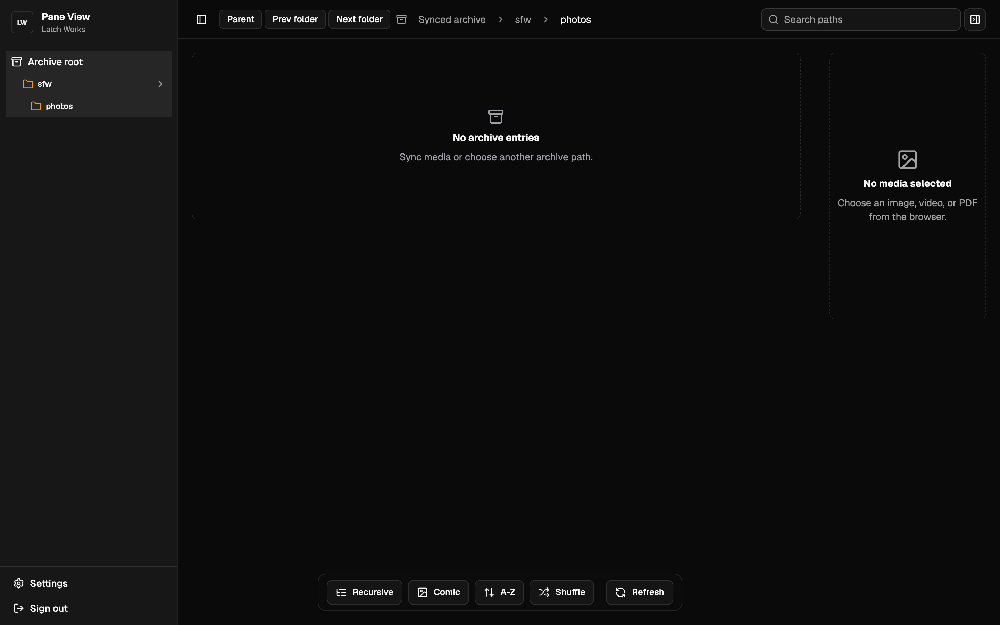
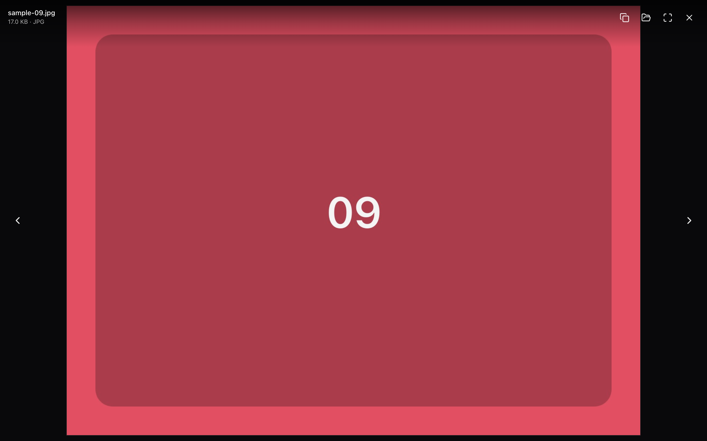
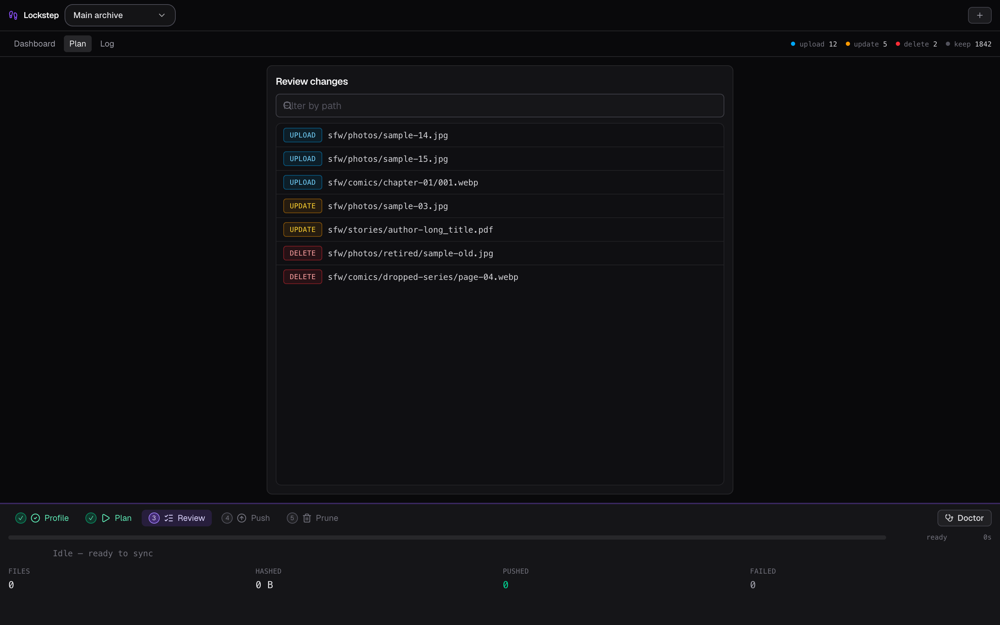
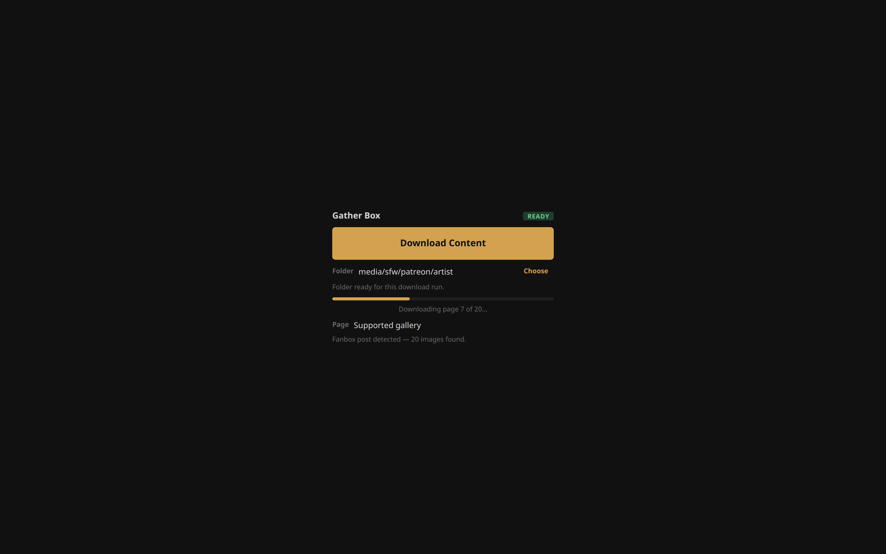

<p align="center">
  
</p>

<p align="center">
  <strong>Everything you need to keep a personal media archive under your own latch</strong><br/>
  <strong>Gather • Organize • Sync • View</strong><br/>
  <sub>Collect galleries from the browser, browse them on the desktop, push them to a private web viewer you own.</sub>
</p>

<p align="center">
  <a href="docs/ARCHITECTURE.md">Architecture</a> ·
  <a href="docs/runbooks/lockstep.md">Lockstep runbook</a> ·
  <a href="apps/showcase">Showcase site</a> ·
  <a href="docs/latch-works-brand-kit.md">Brand kit</a>
</p>

<p align="center">
  <a href="https://www.typescriptlang.org/"></a>
  <a href="https://pnpm.io/"></a>
  <a href="LICENSE"></a>
</p>

# Latch Works

Latch Works is a private workshop for a personal media archive: a Chrome extension that collects, an Electron gallery that reads, a sync client that pushes, and a web viewer that serves it back to you on any device.

**The local archive is the source of truth.** Nothing is public, nothing is inferred from a cloud service. Remote access is explicit, authenticated, and read-only — Lockstep is the only write path.

<table>
<tr>
<td width="40%" valign="middle">

### View the archive anywhere

Pane View is a private web viewer for a synced archive — galleries, videos, and comics on desktop, tablet, and phone. TanStack Start, PostgreSQL, S3, signed renditions via Shutter.

</td>
<td width="60%">



</td>
</tr>
<tr>
<td width="40%" valign="middle">

### Read it locally, first

Frame View is a cross-platform Electron gallery for local images, videos, and comics. It's the UX north star for Pane View — whatever feels right here gets ported there.

</td>
<td width="60%">



</td>
</tr>
<tr>
<td width="40%" valign="middle">

### Sync on your terms

Lockstep plans and pushes archive changes to Pane View. Desktop app with profiles, encrypted token storage, and run history — or a scriptable CLI over the same engine.

</td>
<td width="60%">



</td>
</tr>
<tr>
<td width="40%" valign="middle">

### Collect from the browser

Gather Box downloads image galleries and story PDFs from supported sites straight into inferred local folder structures, ready for the next scan.

</td>
<td width="60%">



</td>
</tr>
</table>

---

## What's in the repo

| Name | Path | What it does |
| --- | --- | --- |
| **Pane View** | [`apps/pane-view`](apps/pane-view) | Private web viewer for a synced archive. TanStack Start + PostgreSQL + S3. |
| **Frame View** | [`apps/frame-view`](apps/frame-view) | Electron desktop gallery for local images, videos, and comics. PDF reading is [planned](docs/plans/040-frame-view-pdf-spike.md), not shipped. |
| **Gather Box** | [`apps/gather-box`](apps/gather-box) | Chrome extension that downloads galleries and story PDFs into local folder structures. |
| **Lockstep** | [`apps/lockstep`](apps/lockstep) | Electron sync client — profiles, encrypted tokens, run history. |
| **Lockstep CLI** | [`apps/lockstep-cli`](apps/lockstep-cli) | Scriptable `plan` / `push` / `verify` / `doctor`. npm package `@latch-works/lockstep`. |
| **Showcase** | [`apps/showcase`](apps/showcase) | Astro product site and MDX docs — pages, screenshots, getting-started guides. |

### Shared packages

| Package | Path | Role |
| --- | --- | --- |
| `@latch-works/media-domain` | [`packages/media-domain`](packages/media-domain) | Media types, path helpers, gallery sort / comic grouping, Zod schemas |
| `@latch-works/media-index` | [`packages/media-index`](packages/media-index) | Archive scanning and sync-plan generation |
| `@latch-works/media-storage` | [`packages/media-storage`](packages/media-storage) | Content-addressed S3 object key conventions |
| `@latch-works/lockstep-core` | [`packages/lockstep-core`](packages/lockstep-core) | Headless sync engine shared by Lockstep desktop and CLI |

---

## Install

Requires **Node.js 22+**, **pnpm 11** (`corepack enable`), and npm on `PATH` for Electron Forge packaging. Pane View additionally needs **PostgreSQL**, **S3-compatible storage**, and **Shutter** access for signed renditions.

```bash
pnpm install
```

Shared packages build to `dist/` and app dev servers import from there, so build them once up front:

```bash
pnpm -r --filter './packages/*' build
```

Then verify the whole workspace — build, checks, lint, knip:

```bash
pnpm check
```

---

## Commands

### Run an app

```bash
pnpm dev:pane                                  # Pane View  → http://127.0.0.1:3000
pnpm dev:showcase                              # Showcase   → http://127.0.0.1:3100
pnpm dev:lockstep                              # Lockstep desktop (Electron dev)
pnpm --filter @latch-works/frame-view start    # Frame View (Electron dev)
pnpm --filter @latch-works/gather-box build    # Gather Box → dist/, load unpacked in Chrome
```

### Sync

`plan` is read-only — it scans the source tree and prints what *would* change:

```bash
pnpm --filter @latch-works/lockstep start plan --source "/path/to/archive"
```

`push` writes to a running Pane View instance:

```bash
export LOCKSTEP_API_URL="http://127.0.0.1:3000"
export LOCKSTEP_API_TOKEN="your-sync-token"
pnpm --filter @latch-works/lockstep start push --source "/path/to/archive"
```

`pnpm start:lockstep` with no arguments opens an interactive wizard when run on a TTY. Full reference: [`apps/lockstep-cli/README.md`](apps/lockstep-cli/README.md) and the [runbook](docs/runbooks/lockstep.md).

### Repo checks

```bash
pnpm lint        # Biome across the repo
pnpm test        # Tests in all packages
pnpm typecheck   # tsc across all packages
pnpm knip        # Unused files, exports, dependencies
pnpm docs:check  # Docs link/consistency check
```

---

## How it works

```
Gather Box downloads a gallery
  -> lands in the local archive as an inferred folder structure
  -> Frame View reads it directly off disk
  -> Lockstep scans the tree and builds a sync plan
  -> plan: read-only diff of local vs remote
  -> push: originals to S3, metadata to PostgreSQL
  -> Pane View serves it back, authenticated and read-only
  -> Shutter signs thumbnail and preview renditions on demand
```

The scan, sort, grouping, and plan logic all live in `packages/` — Lockstep desktop and Lockstep CLI are two front ends over one engine, and Pane View shares the same domain types.

---

## Workspace layout

```text
latch-works/
├── apps/
│   ├── pane-view/       # TanStack Start web viewer
│   ├── frame-view/      # Electron desktop viewer
│   ├── gather-box/      # Chrome extension
│   ├── lockstep/        # Electron desktop sync client
│   ├── lockstep-cli/    # Scriptable sync CLI
│   └── showcase/        # Astro product site and docs
├── packages/
│   ├── media-domain/
│   ├── media-index/
│   ├── media-storage/
│   └── lockstep-core/
└── docs/
    ├── ARCHITECTURE.md
    ├── adr/
    ├── plans/
    └── runbooks/
```

---

## Design principles

- **Private by default** — authentication gates web access. No public galleries, ever.
- **Read-only remote** — Pane View browses; Lockstep writes. There is no third path.
- **Local source of truth** — the desktop archive decides what exists.
- **Shared domain logic** — sorting, grouping, scanning, and sync behavior live in packages, never duplicated per app.

---

## Documentation

| Doc | Description |
| --- | --- |
| [`docs/ARCHITECTURE.md`](docs/ARCHITECTURE.md) | System architecture and the Shutter delivery model |
| [`docs/runbooks/lockstep.md`](docs/runbooks/lockstep.md) | Lockstep operations runbook |
| [`docs/adr/`](docs/adr) | Architecture decision records |
| [`docs/latch-works-brand-kit.md`](docs/latch-works-brand-kit.md) | Naming, tone, and product vocabulary |
| [`docs/electron-macos-signing.md`](docs/electron-macos-signing.md) | Signing and notarizing the Electron apps |
| [`apps/showcase/README.md`](apps/showcase/README.md) | Showcase dev server and screenshot capture |

---

## Naming

The product names follow a window-and-access metaphor:

| Term | Meaning |
| --- | --- |
| **Latch** | Controls access to the archive |
| **Frame** | The desktop viewing surface |
| **Pane** | The web viewing surface |
| **Box** | Collects and stores incoming media |
| **Lockstep** | Keeps local and remote archives in sync |

---

## License

[MIT](LICENSE)
