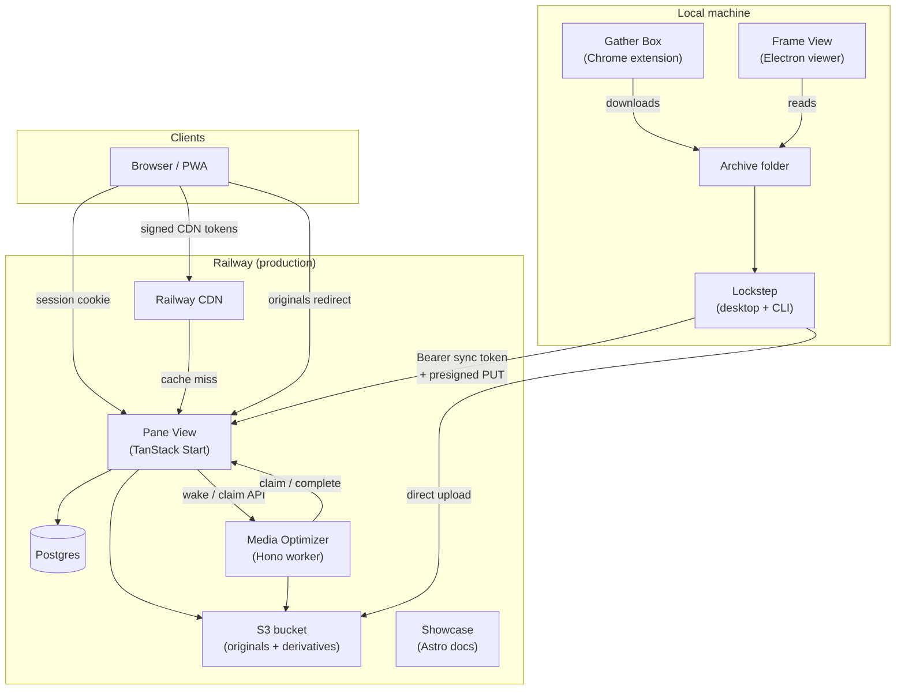
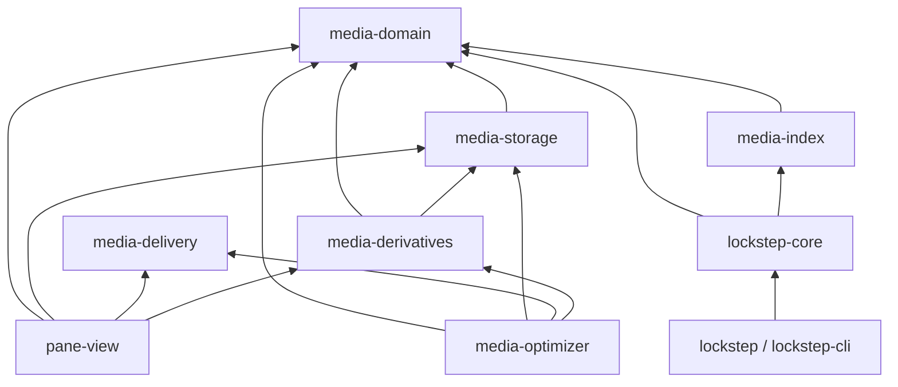
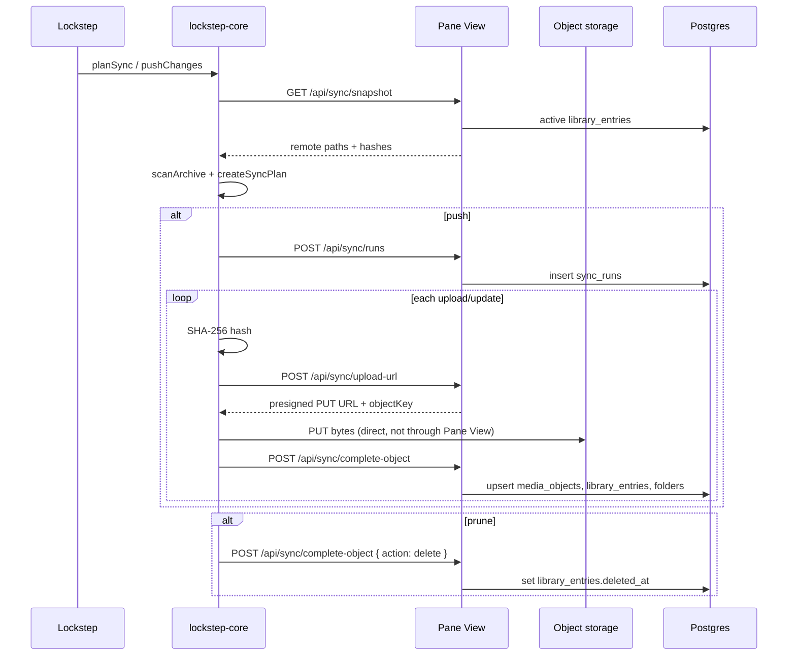
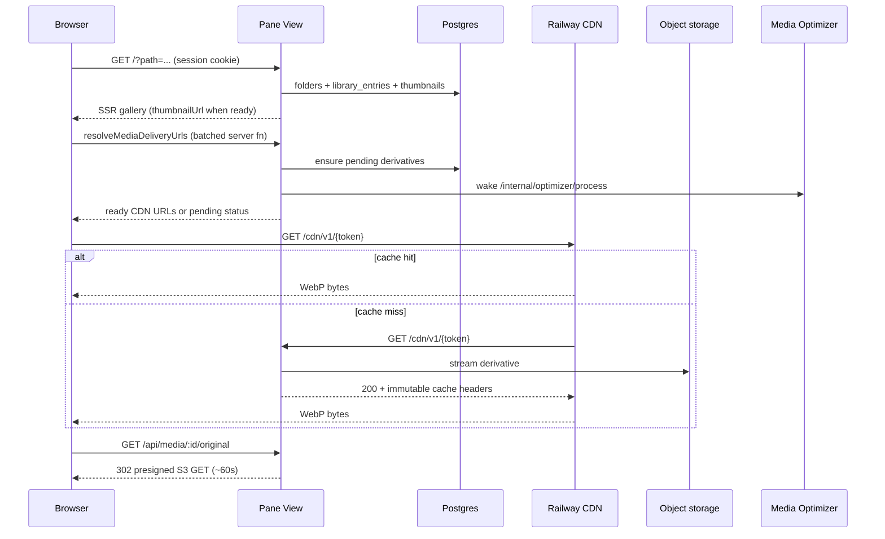
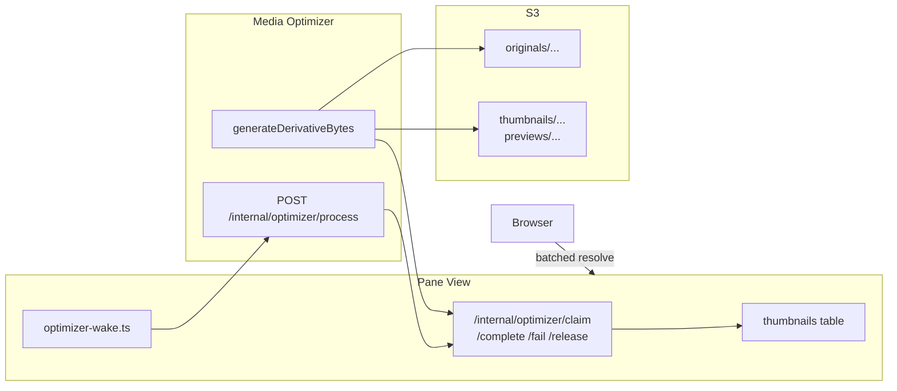
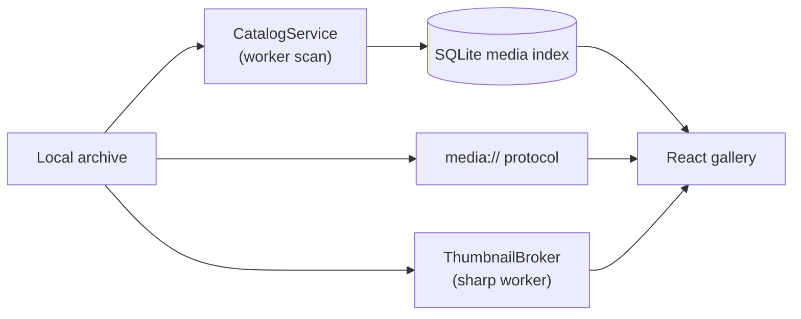
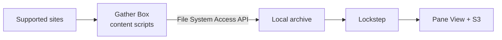

# Latch Works Architecture

Comprehensive overview of how apps, packages, services, and infrastructure interact in the Latch Works monorepo. For step-by-step sync and browse sequences, see [end-to-end-request-flow.md](./end-to-end-request-flow.md). For domain vocabulary, see [CONTEXT.md](../CONTEXT.md).

## Purpose

Latch Works collects, syncs, derives, and serves a **private personal media archive**. The local folder on disk remains the source of truth. A sync client publishes changes to a deployed web service; the browser is read-oriented (with owner-only management actions).

## Monorepo layout

pnpm workspace (`pnpm-workspace.yaml`) with apps under `apps/` and shared libraries under `packages/`.

| Path | Role |
| --- | --- |
| `apps/pane-view` | Web service: auth, library catalog, sync ingest, media delivery, derivative queue |
| `apps/media-optimizer` | Background CPU worker for thumbnail/poster generation |
| `apps/lockstep` | Electron desktop sync client (`@latch-works/lockstep-app`) |
| `apps/lockstep-cli` | Scriptable sync CLI (`@latch-works/lockstep`) |
| `apps/frame-view` | Electron desktop gallery viewer (local archive only) |
| `apps/gather-box` | Chrome extension for collecting media into the archive |
| `apps/showcase` | Astro marketing site and MDX documentation |
| `packages/media-domain` | Shared types, paths, sort, comic grouping, sidecar schema |
| `packages/media-index` | Local archive scan and sync-plan diff logic |
| `packages/media-storage` | S3 client helpers and content-addressed object keys |
| `packages/media-delivery` | Signed CDN delivery tokens and thumbnail size ladder |
| `packages/media-derivatives` | Derivative generation (sharp, ffmpeg) shared by Pane View and optimizer |
| `packages/lockstep-core` | Headless sync engine (plan, push, prune, verify, doctor) |
| `docs/` | Architecture notes, ADRs, runbooks |
| `.railway/railway.ts` | Railway infrastructure-as-code |

Build order matters for local dev: workspace packages compile to `dist/` and must be built (`pnpm build` or `pnpm -r --filter './packages/*' build`) before `pnpm dev:pane` or `pnpm dev:lockstep`.

---

## Apps

### Pane View (`apps/pane-view`)

**Stack:** TanStack Start (React + Router + server functions), Drizzle ORM, Postgres, Better Auth, Nitro/Vite production server.

**Responsibilities:**

- Owner authentication (browser sessions)
- Sync ingest API for Lockstep (`/api/sync/*`)
- Library queries and gallery UI (`/`, `?path=`, `?q=`, `?media=`)
- Media delivery: session-gated authorize routes and HMAC-signed CDN URLs
- Derivative queue state machine in the `thumbnails` table
- Management UI (`/manage`) for sync history, folder delete, library wipe, thumbnail retry
- Internal optimizer coordination (`/internal/optimizer/*`)

**Key modules:**

| Area | Path |
| --- | --- |
| HTTP routes | `src/routes/api.*.ts`, `src/routes/cdn.v1.$.ts`, `src/routes/internal.optimizer.*.ts` |
| DB schema | `src/server/db/schema.ts` |
| Sync ingest | `src/server/sync/store.ts` |
| Library queries | `src/server/library/repository.ts` |
| Derivatives | `src/server/media/derivative-service.ts`, `derivative-queue.ts`, `optimizer-wake.ts` |
| CDN delivery | `src/server/media/cdn-delivery.ts`, `delivery-redirect.ts` |
| Gallery UI | `src/features/gallery/*` |
| Server functions | `src/features/media/media-delivery-service.ts`, `src/features/library/library-service.ts` |

**Workspace dependencies:** `media-domain`, `media-storage`, `media-delivery`, `media-derivatives`

**External services:** Postgres, S3-compatible bucket, optional Media Optimizer (private HTTP), Railway CDN in production.

### Media Optimizer (`apps/media-optimizer`)

**Stack:** Hono HTTP server, `@hono/node-server`.

**Responsibilities:**

- CPU-heavy derivative generation (sharp for images/GIF, ffmpeg for video posters)
- Claims jobs from Pane View, reads originals from S3, writes derivatives to S3, reports completion

**Does not own:** queue state, auth for gallery users, or browser traffic.

**Flow:**

1. Pane View calls `POST /internal/optimizer/process` on the optimizer (fire-and-forget wake).
2. Optimizer calls Pane View `POST /internal/optimizer/claim` to lease `pending` rows.
3. For each job: read original from S3 → `generateDerivativeBytes` → `PUT` derivative → `POST /internal/optimizer/complete` or `/fail`.
4. On shutdown or batch end, unprocessed leases go back via `/internal/optimizer/release`.

**Key modules:** `src/processor.ts`, `src/pane-view-client.ts`, `src/server.ts`

**Workspace dependencies:** `media-domain`, `media-storage`, `media-delivery`, `media-derivatives`

### Lockstep desktop (`apps/lockstep`)

**Stack:** Electron Forge + Vite + React.

**Responsibilities:**

- Profile management (source root, API URL, encrypted sync token via Electron `safeStorage`)
- UI for plan, push, prune, verify, and doctor
- Delegates all sync logic to `@latch-works/lockstep-core`

**IPC:** Zod-backed contracts in `src/shared/ipcContracts.ts`; main process `RunService` streams progress events to the renderer.

**Workspace dependencies:** `lockstep-core` only.

### Lockstep CLI (`apps/lockstep-cli`)

**Stack:** Node + `tsx`, `@inquirer/prompts` for interactive prune confirmation.

**Commands:** `plan`, `push`, `prune`, `verify`, `doctor`

**Credentials:** `LOCKSTEP_API_URL` and `LOCKSTEP_API_TOKEN` (or `--api-url` / env aliases). No encrypted profile store — environment variables only.

**Workspace dependencies:** `lockstep-core` only. Thin wrapper over the same engine as the desktop app.

### Frame View (`apps/frame-view`)

**Stack:** Electron Forge + Vite + React + Zustand + Drizzle (local SQLite media index).

**Responsibilities:**

- Local-only gallery viewer: scan, folder navigation, comic mode, video viewer, thumbnails
- No network sync; reads files from disk via custom `media://` protocol
- Serves as the UX north star for Pane View

**Architecture:** Classic Electron split — `src/main/` (services, IPC, SQLite, sharp/ffmpeg workers), `src/preload.ts` (bridge), `src/renderer/` (React UI).

**Workspace packages:** Not yet wired; comic/sort/path utilities are duplicated locally under `src/renderer/utils/` and `src/shared/`. Extraction to `media-domain` is planned.

### Gather Box (`apps/gather-box`)

**Stack:** TypeScript Chrome extension (esbuild), Manifest V3.

**Responsibilities:**

- Content scripts detect supported sites (Kemono, Fanbox, AO3, FanFiction.net, etc.)
- Downloads galleries and story PDFs into user-chosen archive folders via the File System Access API
- Popup, side panel, options, and background service worker

**Integration today:** Writes files into the local archive only. Optional `.latch-works.source.json` sidecar manifests are designed but not shipped — see [gather-box-sidecar-manifests.md](./gather-box-sidecar-manifests.md).

**Workspace packages:** Not yet wired; path/site types live in `src/shared/`.

### Showcase (`apps/showcase`)

**Stack:** Astro 5 + MDX + `@astrojs/node` SSR.

**Responsibilities:**

- Public documentation and marketing at `latch-works.traydr.dev`
- No access to Postgres, S3, or sync APIs
- Screenshot pipeline (`pnpm screenshots`) can drive Pane View via Puppeteer for doc images

---

## Shared packages

### Dependency graph

### `media-domain`

Pure domain logic with no I/O.

| Export area | Purpose |
| --- | --- |
| `media.ts` | `MediaType`, supported extensions, detection |
| `paths.ts` | Archive path normalization |
| `sort.ts` | Sort modes (name, date, random) |
| `comics.ts` | `buildComicEntries`, numeric filename ordering |
| `browser-entries.ts` | Unified folder/media/comic navigation model |
| `gather-box-sidecar.ts` | Sidecar filename constant and Zod schema (future ingest) |

**Consumers:** `media-index`, `media-storage`, `media-derivatives`, `lockstep-core`, `pane-view`, `media-optimizer`

### `media-index`

| Export | Purpose |
| --- | --- |
| `scanArchive` | Walk local tree, produce `MediaItem[]` with optional hashing |
| `createSyncPlan` | Diff local vs remote → `upload` / `update` / `keep` / `delete` |

**Consumers:** `lockstep-core` only.

### `media-storage`

| Export | Purpose |
| --- | --- |
| `originalObjectKey` | `originals/sha256/ab/cd/<hash>.<ext>` |
| `thumbnailObjectKey` | `thumbnails/sha256/.../<hash>-<size>.webp` |
| `previewObjectKey` | `previews/{video\|pdf}/sha256/...` |
| `createS3StorageClient`, presigned URLs, get/put/head helpers | S3-compatible storage |

Content-addressed keys decouple storage from logical browse paths. Renames and folder moves update Postgres only.

### `media-delivery`

| Export | Purpose |
| --- | --- |
| `createDeliveryTokenSigner` | HMAC tokens for `/cdn/v1/:token` (payload `~` signature) |
| `snapThumbnailSize` | Ladder: 160, 320, 480, 640, 960 |

### `media-derivatives`

| Export | Purpose |
| --- | --- |
| `supportsDerivative`, `buildDerivativeDescriptor` | Which types/sizes can be generated |
| `generateDerivativeBytes` | sharp (image/GIF), ffmpeg poster + sharp (video) |
| `resizeImageToWebp`, `runFfmpeg` | Lower-level helpers |

Shared by Pane View (inline mode) and Media Optimizer (triggered mode) so generation logic is not duplicated.

### `lockstep-core`

Headless sync engine with no console, prompts, or UI.

| Export | Purpose |
| --- | --- |
| `planSync` | Snapshot + scan + plan |
| `pushChanges` | Upload/update loop |
| `pruneDeleted` | Soft-delete remote entries missing locally |
| `doctor` | Preflight checks (API, token, source path) |
| `pushMediaItem`, `postJson` | Per-file hash → upload-url → S3 PUT → complete-object |
| `fetchRemoteSnapshot` | `GET /api/sync/snapshot` |

**Observer pattern:** `LockstepObserver` receives scan/plan/push events for CLI or Electron UI progress.

---

## Data model (Postgres)

Pane View owns all cloud catalog state via Drizzle (`apps/pane-view/src/server/db/schema.ts`).

| Table | Role |
| --- | --- |
| `users`, `sessions`, `accounts` | Better Auth owner login |
| `api_tokens` | Future scoped tokens (sync uses env `PANE_VIEW_SYNC_TOKEN` today) |
| `media_objects` | Content-addressed blob metadata (`sha256`, `object_key`, dimensions, duration) |
| `library_entries` | Browse metadata: `logical_path`, `parent_path`, link to `media_objects` |
| `folders` | Denormalized folder tree inferred from path segments |
| `thumbnails` | **Derivative queue**: `pending` → `processing` → `ready` / `failed`, with lease `processing_token` |
| `sync_runs`, `sync_run_items` | Sync audit trail |
| `collections`, `collection_items` | Comic/story grouping (schema present; limited UI use) |
| `viewer_state` | Per-user resume position (partial wiring) |
| `maintenance_jobs` | Async library wipe and cleanup |

**Soft deletes:** `library_entries.deleted_at` is set by Lockstep `prune`; object bytes in S3 are not automatically removed.

**Logical paths vs object keys:**

- `logical_path` — human archive layout (`sfw/patreon/album/photo.jpg`), used for browsing
- `object_key` — content-addressed S3 key (`originals/sha256/...`), deduplicates identical files

---

## Authentication

Two credential types by design: browser sessions never call sync APIs; the sync token never grants gallery access.

| Client | Credential | Endpoints |
| --- | --- | --- |
| Browser | Better Auth session cookie (`HttpOnly`) | `/`, `/login`, `/api/media/*`, server functions, `/manage` |
| Lockstep | `Authorization: Bearer <PANE_VIEW_SYNC_TOKEN>` | `/api/sync/*` only |
| Media Optimizer | `Authorization: Bearer <MEDIA_OPTIMIZER_TOKEN>` | `/internal/optimizer/*` on both Pane View and optimizer |

**Browser login:** `POST /api/auth/login` validates configured owner username/password, then Better Auth `sign-in/email`. Protected routes and server functions call `isCurrentWebSessionValid()`.

**Sync token:** `requireSyncApiToken()` in `apps/pane-view/src/server/auth/api-token.ts` — constant-time comparison against `PANE_VIEW_SYNC_TOKEN`.

**CDN tokens:** HMAC-signed, time-limited, no session required. Issued only after session validation on authorize routes or server functions. Railway CDN caches derivative bytes at the edge.

---

## Sync request flow (Lockstep → Pane View → S3)

**Sync plan actions** (`packages/media-index/src/sync-plan.ts`):

| Action | Meaning |
| --- | --- |
| `upload` | Local path, not remote |
| `update` | Both sides, size or sha256 differs |
| `keep` | Match |
| `delete` | Remote only — applied by `prune`, not `push` |

After sync completion, Pane View can enqueue derivative prewarm rows and wake the media optimizer (triggered mode). Lockstep does not block on derivative readiness.

---

## Browse and delivery flow (Browser → Pane View → CDN/S3)

| Endpoint | Auth | Behavior |
| --- | --- | --- |
| `GET /api/media/:mediaId/original` | Session | Redirect to short-lived S3 presigned URL |
| `GET /api/media/:mediaId/thumbnail?size=` | Session | Ensure derivative, redirect to `/cdn/v1/{token}` or `503` while pending |
| `GET /api/media/:mediaId/preview?size=` | Session | Video poster / PDF cover variant |
| `GET /cdn/v1/:token` | HMAC token | Stream derivative with long CDN cache headers |
| `resolveMediaDeliveryUrls` | Session (server fn) | Batched resolve for visible grid window (max 48 items) |

Gallery tiles use batched resolution (`src/features/gallery/batched-thumbnail-resolver.ts`) rather than per-tile polling. The viewer loads originals via `/api/media/${id}/original`.

---

## Derivative queue and processing modes

The **derivative queue** is the durable `thumbnails` table state machine. Pane View owns scheduling; generation runs either inline in the web process or in the separate Media Optimizer.

**States:** `pending` → `processing` → `ready` | `failed`

**Lease model:** `processing_token` prevents double generation. Stale `processing` rows (10-minute lease) are reclaimable. See `derivative-lease.ts`.

**Processing modes** (`DERIVATIVE_PROCESSING_MODE` in `apps/pane-view/src/env/server.ts`):

| Mode | Behavior |
| --- | --- |
| `inline` | Pane View generates with sharp/ffmpeg in-process (concurrency limit 2). Default for local dev. |
| `triggered` | Pane View enqueues `pending` rows and wakes Media Optimizer. Production Railway default. |

**Generation by type** (`media-derivatives`):

| Media | Tool | Storage prefix |
| --- | --- | --- |
| Image / GIF | sharp → WebP | `thumbnails/sha256/...` |
| Video | ffmpeg poster + sharp | `previews/video/sha256/...` |
| PDF | Planned (pdf.js + canvas) | `previews/pdf/sha256/...` |

---

## Local-only data flows

### Frame View

No Pane View, S3, or Lockstep involvement. Settings and scan state persist locally.

### Gather Box → Archive → Lockstep → Pane View

Gather Box is the **collection** stage; Lockstep is the **publish** stage. They do not talk directly.

---

## HTTP API surface (Pane View)

### Public / session-authenticated

| Method | Path | Purpose |
| --- | --- | --- |
| `GET` | `/api/health` | Liveness |
| `POST` | `/api/auth/login` | Owner login |
| `POST` | `/api/auth/logout` | Session teardown |
| `GET` | `/api/media/:mediaId/original` | Original delivery redirect |
| `GET` | `/api/media/:mediaId/thumbnail` | Thumbnail authorize + redirect |
| `GET` | `/api/media/:mediaId/preview` | Preview authorize + redirect |
| `GET` | `/cdn/v1/*` | CDN token stream |

### Sync (bearer token)

| Method | Path | Purpose |
| --- | --- | --- |
| `GET` | `/api/sync/snapshot` | Remote catalog for plan/verify |
| `POST` | `/api/sync/runs` | Start sync run |
| `POST` | `/api/sync/runs/:id/complete` | Finalize run |
| `POST` | `/api/sync/upload-url` | Presigned PUT for original |
| `POST` | `/api/sync/complete-object` | Ingest metadata or soft-delete |

### Internal (optimizer bearer token)

| Method | Path | Purpose |
| --- | --- | --- |
| `POST` | `/internal/optimizer/claim` | Lease pending derivative jobs |
| `POST` | `/internal/optimizer/complete` | Mark job ready |
| `POST` | `/internal/optimizer/fail` | Record failure / backoff |
| `POST` | `/internal/optimizer/release` | Return unprocessed leases |
| `GET` | `/internal/optimizer/queue-status` | Queue diagnostics |

Media Optimizer exposes `POST /internal/optimizer/process` and `GET /internal/optimizer/status` on its own host (Pane View wakes it).

---

## Deployment (Railway)

Defined in `.railway/railway.ts`:

| Service | Domain / networking | Notes |
| --- | --- | --- |
| **Pane View** | `pane-view.traydr.dev`, private `latch-works` | Pre-deploy `db:migrate`, `DERIVATIVE_PROCESSING_MODE=triggered` |
| **Media Optimizer** | Private `latch-works-media-optimizer` only | Serverless sleep, 2 CPU / 6 GB, drains due derivative work until empty |
| **Showcase** | `latch-works.traydr.dev` | Static docs, no secrets |
| **Postgres** | Private to Pane View | `DATABASE_URL` |
| **balanced-wrap bucket** | S3-compatible (AMS) | Shared by Pane View and Media Optimizer |

**Environment wiring:**

- Pane View `MEDIA_OPTIMIZER_URL` → optimizer private URL
- Shared `MEDIA_OPTIMIZER_TOKEN` between Pane View and optimizer
- Shared S3 credentials for originals and derivatives
- `MEDIA_DELIVERY_SECRET` for CDN token signing

Local development uses root `.env` (see `.env.example`), PostgreSQL, and MinIO as S3. Symlink `apps/pane-view/.env` → `../../.env`.

---

## Management and maintenance

The `/manage` route (authenticated owner) exposes:

- Sync run history and cancellation
- Folder delete and library hard wipe (async `maintenance_jobs`)
- Failed thumbnail retry and purge
- Optimizer queue status overview

Cleanup workers run in the Pane View process (`src/server/management/cleanup-worker.ts`).

---

## Testing and quality gates

| Command | Scope |
| --- | --- |
| `pnpm check` | Build all packages, typecheck apps, Biome lint, knip |
| `pnpm test` | Vitest across workspace |
| `pnpm --filter @latch-works/pane-view test` | Pane View unit tests (derivatives, auth, sync) |
| `pnpm --filter @latch-works/lockstep test` | CLI tests (unset `LOCKSTEP_API_URL` when testing missing-field behavior) |

Integration tests cover sync validation, CDN token verification, derivative queue claiming, and optimizer processor logic.

---

## Evolution and boundaries

| Concern | Current state | Direction |
| --- | --- | --- |
| Frame View shared packages | Local duplicates | Extract to `media-domain`, shared UI later |
| Gather Box sidecars | Design only | `.latch-works.source.json` for richer Pane View metadata |
| `media-ui` package | Not created | Shared React gallery/viewer components |
| Remote object deletion | Soft-delete metadata only | Explicit prune/cleanup jobs for orphan blobs |
| Multi-user | Single owner | Schema supports users; product is single-user |
| Tresorit | Backup only, not runtime | Optional future source adapter for Lockstep |

---

## Related documentation

| Document | Topic |
| --- | --- |
| [end-to-end-request-flow.md](./end-to-end-request-flow.md) | Detailed Lockstep push and browse sequences |
| [runbooks/lockstep.md](./runbooks/lockstep.md) | CLI setup, doctor, push, prune |
| [runbooks/pane-view-thumbnails.md](./runbooks/pane-view-thumbnails.md) | Thumbnail pipeline |
| [runbooks/media-optimizer.md](./runbooks/media-optimizer.md) | Optimizer deployment and diagnostics |
| [media-optimizer-internals.md](./media-optimizer-internals.md) | Optimizer request flow, claiming, and image/video conversion |
| [runbooks/railway-cdn-pane-view.md](./runbooks/railway-cdn-pane-view.md) | CDN setup and cache verification |
| [gather-box-sidecar-manifests.md](./gather-box-sidecar-manifests.md) | Future metadata sidecars |
| [derivative-prewarm-and-workers.md](./derivative-prewarm-and-workers.md) | Pre-warm and worker strategy |
| [adr/0001-durable-derivative-queue.md](./adr/0001-durable-derivative-queue.md) | Derivative queue ADR |
| [ARCHITECTURE_PLAN.md](./ARCHITECTURE_PLAN.md) | Historical planning document (partially superseded) |
| [AGENTS.md](../AGENTS.md) | Repo conventions for contributors |

## Key source entry points

| Area | Path |
| --- | --- |
| Sync push loop | `packages/lockstep-core/src/remote-api.ts`, `push-changes.ts` |
| Sync plan | `packages/media-index/src/sync-plan.ts` |
| Sync API routes | `apps/pane-view/src/routes/api.sync.*.ts` |
| Ingest store | `apps/pane-view/src/server/sync/store.ts` |
| Gallery route | `apps/pane-view/src/routes/_gallery/index.tsx` |
| Library query | `apps/pane-view/src/server/library/repository.ts` |
| Derivative service | `apps/pane-view/src/server/media/derivative-service.ts` |
| Optimizer processor | `apps/media-optimizer/src/processor.ts` |
| Object key layout | `packages/media-storage/src/index.ts` |
| CDN tokens | `packages/media-delivery/src/token.ts` |
| Railway IaC | `.railway/railway.ts` |
