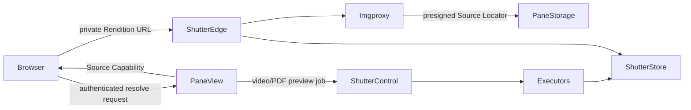

# Latch Works Architecture

Latch Works is a TypeScript pnpm workspace for collecting, syncing, and viewing a private media
archive. The local archive is authoritative; Pane View owns the web library, end-user authorization,
source-object storage, and source retention.

## Applications

| Application | Responsibility |
| --- | --- |
| Pane View | Authenticated web library, media metadata, original delivery, and Shutter authorization |
| Lockstep | Desktop sync planning and push UX |
| Lockstep CLI | Scriptable sync client over `lockstep-core` |
| Frame View | Local desktop viewer |
| Gather Box | Browser collector whose side panel controls independently owned Gather Runs |
| Showcase | Marketing and ecosystem documentation |

Shared media identity and path behavior live in `media-domain`; archive scanning and sync planning
live in `media-index`; S3-compatible source storage lives in `media-storage`.

## Gather Box

Gather Box uses the side panel as its only full control surface. A visible panel is an adapter over a
persisted Gather Run; closing it does not cancel archive writes. The extension service worker owns
run identity, exact source-tab targeting, state, and command coordination. An offscreen extension
document executes remote fetches, File System Access writes, and generated story PDFs after a visible
UI has granted any required directory permission.

Collected Gather Outputs enter a persisted FIFO queue. Page inspection is the short foreground
capture step; once an output reports as queued, its source tab can navigate or close. The offscreen
document executes one queued output at a time so CPU-heavy AVIF conversion and archive writes do
not compete across posts. Pending collected outputs survive service-worker suspension and are
requeued after browser restart; a capture interrupted before metadata exists must be queued again.

One Gather Source catalog owns supported-site URL, permission, collector, credential, and save
behavior policy. The always-on page content contains only the page-key adapter; a run injects the
collector selected for its exact source. Source-file batches and generated story PDFs are separate
Gather Output adapters, and the heavy PDF implementation loads only for its output kind.

See [ADR 0001](./adr/0001-gather-box-run-architecture.md) and Plans
[041](./plans/041-own-gather-runs-outside-ui.md)–[045](./plans/045-load-gather-collectors-on-demand.md).

## Pane View and Shutter

Shutter is Pane View's only rendition provider. Pane View does not generate, queue, store, or serve
thumbnail and preview derivatives.

- Images and GIFs use request-driven Shutter Image Optimization.
- Videos and PDFs use a durable Shutter Master Preview, resized by Shutter for gallery and detail
  widths.
- Original delivery remains a short-lived Pane View presigned redirect for playback and explicit
  original viewing or download.
- Pane View issues encrypted, purpose-bound Source Capabilities only after its own session checks.
- SHA-256 is the immutable Shutter Source ID; a presigned S3 URL is the replaceable Source Locator.
- A hard library wipe or deleted-item purge deletes each now-unreferenced original, requests Shutter
  Source Purge, and deletes the media row only after Shutter confirms the purge. Soft deletion alone
  retains both source systems.
- Soft-delete and Lockstep `prune` only mark library entries/folders deleted in PostgreSQL. S3
  originals and Shutter assets remain until an explicit deleted-item purge or hard wipe.

The authenticated media resolver accepts `mediaId`, `thumbnail | preview | original`, and an
optional width. Batch requests contain at most 48 items and independently return `ready`, `pending`
with `retryAfterMs`, or `failed`.

## Sync and storage

Lockstep uploads immutable originals under deterministic SHA-256 keys. Pane View records media and
library-entry metadata in PostgreSQL. Soft-delete (folder delete, entry delete) and Lockstep `prune`
only mark library rows deleted; S3 originals and Shutter assets remain until an explicit deleted-item
purge or hard wipe.

Pane View does not prewarm renditions. Shutter images are created on demand, while video and PDF
jobs begin when their first rendition is requested.

## Deployment

Railway hosts Pane View, Showcase, PostgreSQL, and the Pane View source bucket. Shutter is deployed
and operated independently with its own Control, Edge, executor, database, and rendition storage.
Pane View requires its Shutter Space API token and capability-key registry at startup.

The one-time cleanup of retired `thumbnails/` and `previews/` storage prefixes has been completed,
and the Management page tooling that drove it was removed in July 2026. The
`legacy_derivative_cleanup` value stays declared in `maintenance_job_type` so historical
`maintenance_jobs` rows remain readable; nothing schedules jobs of that type any more.
