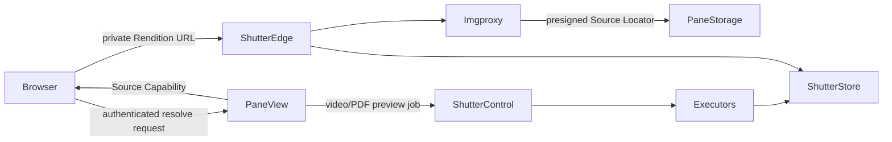

# Latch Works Architecture

Latch Works is a TypeScript pnpm workspace for collecting, syncing, and viewing a private media
archive. The local archive is authoritative; Pane View owns the web library, end-user authorization,
source-object storage, and source retention.

## Applications

| Application | Responsibility |
| --- | --- |
| Pane View | Authenticated web library, media metadata, original delivery, and Shutter authorization |
| Lockstep | Desktop sync planning and push UX |
| Lockstep CLI | Scriptable sync client over `lockstep-core` |
| Frame View | Local desktop viewer |
| Gather Box | Browser collector |
| Showcase | Marketing and ecosystem documentation |

Shared media identity and path behavior live in `media-domain`; archive scanning and sync planning
live in `media-index`; S3-compatible source storage lives in `media-storage`.

## Pane View and Shutter

Shutter is Pane View's only rendition provider. Pane View does not generate, queue, store, or serve
thumbnail and preview derivatives.

- Images and GIFs use request-driven Shutter Image Optimization.
- Videos and PDFs use a durable Shutter Master Preview, resized by Shutter for gallery and detail
  widths.
- Original delivery remains a short-lived Pane View presigned redirect for playback and explicit
  original viewing or download.
- Pane View issues encrypted, purpose-bound Source Capabilities only after its own session checks.
- SHA-256 is the immutable Shutter Source ID; a presigned S3 URL is the replaceable Source Locator.
- A hard library wipe deletes each original, requests Shutter Source Purge, and deletes the media row
  only after Shutter confirms the purge. Soft deletion retains both source systems.

The authenticated media resolver accepts `mediaId`, `thumbnail | preview | original`, and an
optional width. Batch requests contain at most 48 items and independently return `ready`, `pending`
with `retryAfterMs`, or `failed`.

## Sync and storage

Lockstep uploads immutable originals under deterministic SHA-256 keys. Pane View records media and
library-entry metadata in PostgreSQL. Sync deletion soft-deletes library entries; physical source
deletion happens only through an explicit hard wipe.

Pane View does not prewarm renditions. Shutter images are created on demand, while video and PDF
jobs begin when their first rendition is requested.

## Deployment

Railway hosts Pane View, Showcase, PostgreSQL, and the Pane View source bucket. Shutter is deployed
and operated independently with its own Control, Edge, executor, database, and rendition storage.
Pane View requires its Shutter Space API token and capability-key registry at startup.

Before the Shutter-only schema migration is deployed, run
`pnpm --filter @latch-works/pane-view cleanup:legacy-derivatives` using the production database and
source-storage configuration. The command is resumable and must finish with zero errors before the
`thumbnails` table is dropped.
