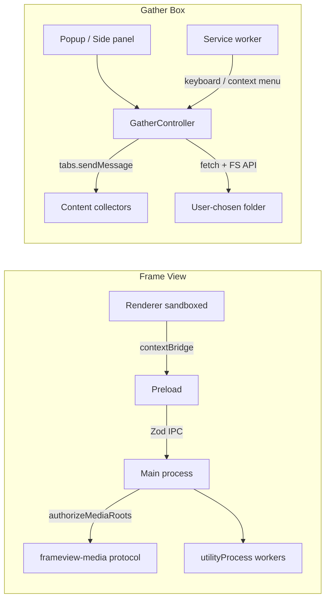

# Code Review: Frame View & Gather Box

**Date:** 2026-06-12  
**Scope:** `apps/frame-view/` (Electron viewer), `apps/gather-box/` (browser collector)

---

## Frame View

### Executive summary

Frame View is a well-layered Electron app with strong security defaults (`contextIsolation`, `nodeIntegration: false`, `sandbox: true`), Zod-validated IPC contracts, and a solid main-process test suite (21 test files). The main security gap is **inconsistent path authorization** — `listFolderChildren` IPC can enumerate arbitrary directories while the custom `frameview-media://` protocol correctly checks `isAuthorizedMediaPath`.

### Findings

#### High

**1. `listFolderChildren` IPC enumerates arbitrary directories without authorization**

`revealInFolder` and `probeVideoMetadata` call `isAuthorizedMediaPath`, but `listFolderChildren` does not. Any renderer code (or renderer compromise) can probe directory names anywhere on disk.

```194:218:apps/frame-view/src/main/ipc/registerIpc.ts
  ipcMain.handle(
    InvokeIpcContracts.listFolderChildren.channel,
    async (_event, folderPath: unknown) => {
      // validates path shape only — no isAuthorizedMediaPath check
      const childrenResult = await listFolderChildren(resolvedPath);
```

**Impact:** Local filesystem enumeration outside opened media roots.

**Fix:** Require `isAuthorizedMediaPath(resolvedPath)` (or ancestry within an authorized root) before `listFolderChildren`.

#### Medium

**2. No navigation / window-open hardening on `webContents`**

No `will-navigate`, `will-redirect`, or `setWindowOpenHandler` guard. If the renderer ever loads untrusted content, the window could navigate away from the bundled app origin.

**3. CSP allows `unsafe-eval` and broad `connect-src`**

`index.html` CSP includes `script-src 'self' 'unsafe-eval'` and `connect-src 'self' ws: wss: http: https:`. `unsafe-eval` weakens XSS containment. Broad `connect-src` allows exfiltration to any origin if script execution is achieved.

**4. DevTools auto-open in dev builds**

Fine for local dev; ensure packaged builds never hit this branch.

**5. `authorizedMediaRoots` grows without pruning**

Every folder opened/scanned is permanently authorized for the session. Long-lived sessions widen the readable filesystem surface.

**6. `VideoProbeRequestSchema` rejects `mtimeMs === 0`**

Files with epoch mtime (rare but valid) fail validation and skip probing.

**7. IPC handlers do not validate `event.sender`**

All channels accept invocations from any frame. Low risk with a single main window today, but not defense-in-depth if additional `BrowserWindow` instances are added.

#### Low

- **L1** — Diagnostics leak `ffmpegPath` / `ffprobePath` to renderer.
- **L2** — Thumbnail failure falls back to full original file (performance concern).
- **L3** — `resolveInputPath` confirms path existence without authorization (path oracle).

### Positive observations

- Strong Electron defaults: `contextIsolation: true`, `nodeIntegration: false`, `sandbox: true`.
- Production fuses configured: `RunAsNode` off, `OnlyLoadAppFromAsar`, integrity validation.
- IPC boundary discipline: Zod contracts, serialized `better-result` payloads.
- Custom protocol authorization: `frameview-media://` checks `isAuthorizedMediaPath` before serving.
- Worker isolation: catalog and thumbnail work in `utilityProcess` workers.
- Solid main-process test suite (21 test files).

### Test coverage gaps

| Area | Status |
|------|--------|
| IPC authorization for `listFolderChildren` | **Not tested** |
| End-to-end `protocol.handle` 403 for unauthorized paths | **Not tested** (only helper unit tests) |
| `mediaToolsService` / ffmpeg spawning | **No tests** |
| `folderService` | **No tests** |
| Renderer hooks | **No tests** |
| `ViewerModal` / video playback | **No tests** |
| Windows-path `mediaProtocol.test.ts` | **Fails on Linux** (known repo caveat) |

---

## Gather Box

### Executive summary

Gather Box has clean site-modular architecture and the FANBOX collector demonstrates the right security model (host + extension allowlist). However, it trusts page DOM output too eagerly at the fetch/write boundary. **Fanfiction PDF fonts are missing from the repo**, making that feature ship-blocking.

**Zero automated tests** — `check` is only `typecheck && build`.

### Findings

#### High

**1. Fanfiction PDF fonts are referenced but not shipped — feature is broken**

```281:284:apps/gather-box/src/popup/fanfiction-story.ts
    loadFont(pdf, "assets/fonts/NotoSerif-Regular.ttf"),
    loadFont(pdf, "assets/fonts/NotoSerif-Italic.ttf"),
    loadFont(pdf, "assets/fonts/NotoSerif-Bold.ttf"),
    loadFont(pdf, "assets/fonts/NotoSerif-BoldItalic.ttf")
```

The repo contains only `assets/fonts/OFL.txt`; no `.ttf` files exist. `loadFont` throws on non-OK response. **FanFiction.Net PDF generation will fail at runtime.**

**2. Download URLs are not allowlisted before `fetch`**

```60:61:apps/gather-box/src/popup/downloader.ts
      const response = await fetch(image.originalUrl, { credentials: options.credentials ?? "omit" });
```

Collectors pass through DOM-derived URLs with inconsistent host validation:

| Collector | Validation |
|-----------|------------|
| FANBOX | Strong (host + extension) |
| Kemono | None — any `href` on file links |
| MyHentaiGallery | Path substring `/thumbnail/` only |
| AO3 / HF stories | `.pdf` suffix only, no host check |

With `credentials: "include"` (AO3, FANBOX, HF), a compromised page could cause cookie-bearing requests to unexpected URLs.

**Fix:** Central `assertAllowedDownloadUrl(site, url)` called from both collectors and `downloader.ts`.

**3. Filenames from the DOM are not sanitized before write**

Collectors set `fileName` from URL basename or `download` attribute without calling `sanitizeFileName`. Story PDFs use `buildStoryPdfFileName` (sanitized); gallery images generally do not.

#### Medium

**4. Zero automated tests**

No Vitest/Jest. Collectors, downloader, path sanitization, credentials logic, and PDF pipeline are all untested.

**5. Documentation vs implementation mismatch on filenames**

README manual check expects sequential names (`001.webp`, `002.webp`), but collectors use CDN basenames. `pageNumber` is metadata only.

**6. Retry path replays stored URLs without re-validation**

`last-run.ts` persists `retryImages`; `handleRetryFailed` fetches them directly. Tampered `chrome.storage.local` or stale URLs are replayed as-is.

**7. `getDestinationDirectoryFromPreview` does not re-sanitize segments**

Retry reads persisted preview without passing through `sanitizePathSegment` again.

**8. Dynamic script injection without in-function URL guard**

`ensureCollectorAndCollect` does not check `isSupportedUrl` itself — callers do, but a future caller bug could inject into any tab.

**9. Version skew**

`manifest.json` is `0.2.0`; `package.json` is `0.1.0`.

**10. `credentialsMode: "always"` sends cookies on every fetch**

Combined with missing URL allowlisting, unnecessarily broad.

#### Low

- **L1** — IndexedDB database still named `comic-downloader` (legacy naming).
- **L2** — Content script uses synchronous `sendResponse` only (async collection refactor would break silently).

### Positive observations

- Clean architecture: `GatherController` shared by popup and side panel; collectors isolated per site.
- FANBOX collector is the security model to emulate.
- Folder segment sanitization via `sanitizePathSegment` / `sanitizeFileName`.
- UI resists XSS: log lines use `textContent`, not `innerHTML`.
- Configurable credentials policy with per-site overrides.
- Minimal permissions: no `<all_urls>`; host permissions scoped to supported sites.
- Concurrency pool in downloader is well-structured.

### Test coverage gaps

| Area | Status |
|------|--------|
| **Entire test suite** | **Missing** |
| Per-site collectors (DOM fixtures) | Not covered |
| `sanitizePathSegment` / `sanitizeFileName` | Not covered |
| `shouldIncludeCredentials` | Not covered |
| `downloadImages` / `runPool` | Not covered |
| `saveFanfictionStoryPdf` / font loading | Not covered |
| `GatherController` state machine | Not covered |

---

## Cross-cutting architecture



**Domain duplication:** `frame-view` reimplements `buildComicEntries`, `sortComicEntries`, `sortMediaItems` in renderer utils instead of importing `@latch-works/media-domain`. Drift risk as pane-view evolves on the shared package.

---

## Recommended priority fixes

1. **Gather Box:** Add Noto Serif font files (or bundle alternatives) for PDF generation.
2. **Gather Box:** Add centralized download URL + filename validation in `downloader.ts`.
3. **Frame View:** Add authorization check to `listFolderChildren`.
4. **Gather Box:** Introduce Vitest with collector fixture tests.
5. **Frame View:** Add navigation guards and tighten production CSP.
6. **Frame View:** Import `@latch-works/media-domain` instead of duplicating sort/comics logic.
