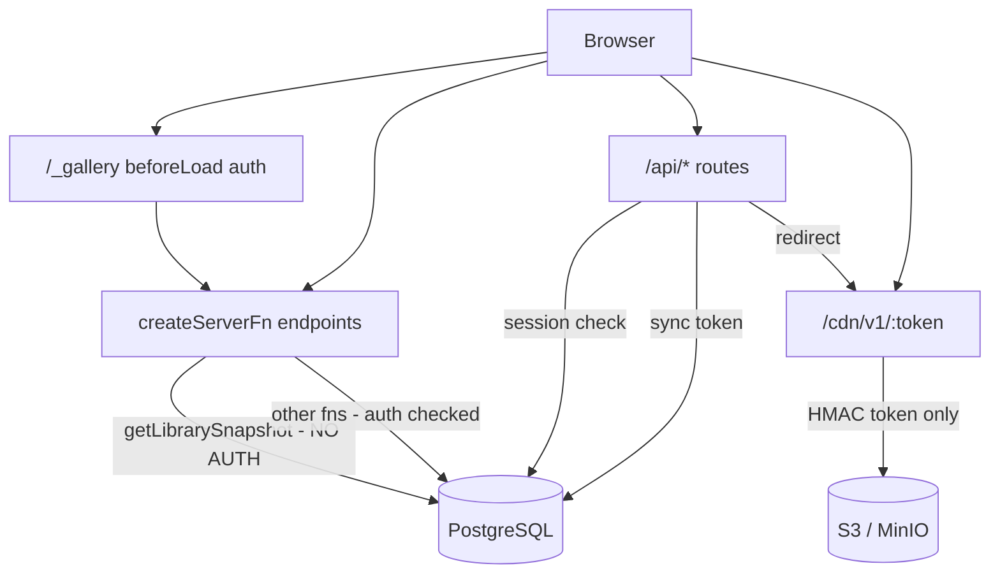

# Code Review: Pane View

**Date:** 2026-06-12  
**Scope:** `apps/pane-view/` — TanStack Start web viewer

---

## Executive summary

Pane View has solid foundations: timing-safe credential comparison, owner-only session binding, layered media delivery, and clean package boundaries. The most urgent issue is an **unauthenticated `getLibrarySnapshot` server function** that exposes archive metadata and, for ready thumbnails, pre-signed CDN URLs that bypass media API authentication. The main systemic risk is **inconsistent auth enforcement** across TanStack Start server functions versus file routes — route-level guards are not sufficient protection for server fn endpoints.

Test coverage is negligible relative to app complexity (one test file, six cases).

---

## Architecture



**Strengths:** Clear split between `routes/` (HTTP handlers), `features/` (server fns + UI), and `server/` (repositories). Shared media packages keep key naming consistent.

**Weaknesses:** Auth is opt-in per handler rather than enforced at middleware. Schema has unused tables (`api_tokens`, `favorites`, `collections`). Minimal automated tests.

---

## Findings

### Critical

#### 1. `getLibrarySnapshot` server function has no authentication

The gallery route guard (`/_gallery` `beforeLoad`) only protects page navigation. TanStack Start `createServerFn` handlers are independently callable over HTTP and do not inherit route guards.

```48:74:apps/pane-view/src/features/library/library-service.ts
export const getLibrarySnapshot = createServerFn({ method: "GET" })
  .inputValidator(libraryRequestSchema)
  .handler(async ({ data }): Promise<LibrarySnapshot> => {
    const currentPath = normalizeLibraryPath(data.path);
    // ... no session check ...
    const databaseSnapshot = await readDatabaseLibrarySnapshot({ ... });
    return {
      // ... full archive metadata ...
      mediaUrlMode: "signed-url",
      roots: databaseSnapshot.roots.length ? databaseSnapshot.roots : readFixtureRoots(currentPath),
    };
  });
```

Sibling functions (`deleteLibraryEntry`, `resolveMediaDeliveryUrl`) do check auth via `isCurrentWebSessionValid()`.

**Impact:** Unauthenticated callers can enumerate logical paths, filenames, SHA-256 hashes, sizes, media types, and entry UUIDs. With `recursive=true` or search pagination, they can page through the archive (up to 5,000 rows per non-search request, 200 per search page).

**Compounding factor:** Ready thumbnails embed signed CDN URLs directly in the snapshot via `buildGalleryThumbnailUrl` → `buildSignedCdnDeliveryUrl`. CDN tokens are valid for `MEDIA_DELIVERY_TTL_SECONDS` (default 24h) and grant access via the unauthenticated `/cdn/v1/$` route.

**Fix direction:** Add `isCurrentWebSessionValid()` at the top of the handler. Consider not embedding signed CDN URLs in responses; return opaque API paths and resolve after auth.

---

### High

#### 2. No brute-force protection on login

`POST /api/auth/login` accepts unlimited credential attempts with no rate limiting, lockout, or CAPTCHA. Combined with `minPasswordLength: 1` in Better Auth config and a single-user model, this is a practical guessing surface for a private archive.

#### 3. Sync API accepts arbitrary `objectKey` without validation

`POST /api/sync/complete-object` passes `objectKey` from the request body without checking it matches the content-addressed pattern from `sha256`/`extension`/`mediaType`. A sync-token holder can associate library entries with any key in the configured bucket.

Similarly, `sha256` format is not validated at the API layer (unlike `media-storage` helpers which require `/^[a-f0-9]{64}$/i`).

#### 4. Derivative generation is an authenticated DoS vector

Thumbnail/preview endpoints and `regenerateMediaThumbnail` trigger `sharp` and `ffmpeg` work synchronously in the request path. No per-user rate limits, queue, or concurrency cap. An authenticated user can hammer many distinct `mediaId` values and force CPU/memory-heavy work (up to 512 MB per source).

#### 5. Thumbnails can get stuck in `processing` forever

If the process crashes after claiming `processing`, the row never recovers. API routes return perpetual `503` with `Retry-After: 1`. No timeout, stale-job reclaim, or admin reset path.

---

### Medium

#### 6. CDN cache TTL far exceeds token TTL

`CDN_CACHE_CONTROL = "public, max-age=31536000, immutable"` while tokens expire per `MEDIA_DELIVERY_TTL_SECONDS` (default 86,400s). Leaked `/cdn/v1/...` URLs remain usable at the edge/browser after server-side expiry. Documented operational mitigation exists (rotate secret, purge CDN), but the mismatch is a real exposure window.

#### 7. Inconsistent auth patterns across entry points

| Entry point | Auth mechanism |
|---|---|
| Media API routes | `isRequestSessionValid({ request })` |
| Most server fns | `isCurrentWebSessionValid()` |
| Viewer state | `readRequestSessionUserId` + owner email check |
| Library snapshot | **None** |
| CDN route | HMAC token only (by design) |
| Sync API | Bearer token |

A shared `requireWebSession()` helper used everywhere would reduce regression risk.

#### 8. Owner password re-hashed on every successful login

Every login rewrites the credential account password hash. Unnecessary DB write; could cause contention under concurrent logins.

#### 9. Predictable owner email for Better Auth

`.env.example` exposes a sample username. Combined with no rate limiting, the attack surface for sign-in is well-defined. Better Auth routes are not publicly mounted in `routeTree.gen.ts` (only custom login/logout wrappers).

#### 10. `api_tokens` table and `hashApiToken` are unused

Schema defines `api_tokens` with `sync_runs.created_by_token_id` FK, but sync auth uses a single env var via `verifySyncApiToken`. Dead schema drift.

#### 11. No CSRF protection on state-changing forms

Login and logout use plain HTML `POST` forms without CSRF tokens. SameSite cookies likely mitigate cross-site POST in modern browsers.

#### 12. Server function errors are unstructured

Unauthorized paths throw generic `Error("Unauthorized")` rather than typed HTTP errors. Clients may see opaque 500s.

#### 13. Hardcoded fixture roots when DB has no folders

```typescript
const fixtureRoots = ["nsfw", "nsfw-stories", "sfw", "sfw/patreon"];
```

Empty databases show hardcoded navigation roots — dev artifact that could leak intended archive structure.

---

### Low

- **L1** — `toArchivePath` does not normalize `..` segments (odd folder hierarchies in DB).
- **L2** — `GET /api/health` is unauthenticated (minor info disclosure).
- **L3** — `collections` and `favorites` schema exist but have no application code.
- **L4** — `viewer-state-service` is defined but not wired to UI.

---

## Security assessment

| Area | Assessment |
|---|---|
| **SQL injection** | Low risk. Drizzle parameterized queries; `escapeLikePattern` correctly escapes `%` and `_`. |
| **SSRF** | Low risk. S3 access uses configured client/bucket only. |
| **Path traversal (filesystem)** | Not applicable; archive paths are logical DB keys. |
| **Path traversal (S3 keys)** | Medium for sync-token holders — unvalidated `objectKey. |
| **CDN token forgery** | Well implemented — HMAC-SHA256, `timingSafeEqual`, expiry check. |
| **Session hijacking** | Owner-only sessions enforced via email check in `web-session-core.ts`. |

---

## Positive observations

1. Timing-safe credential comparison for login and sync token.
2. Owner-only session binding — sessions for non-configured users are rejected.
3. Sign-up disabled (`disableSignUp: true`) for single-user deployment.
4. Layered media delivery — API routes check session; CDN uses signed tokens; originals use short-lived presigned URLs (60s).
5. Soft-delete respected in media queries.
6. Env validation via `@t3-oss/env-core` with sensible constraints.
7. Derivative pipeline uses claim-based concurrency (`pending` → `processing`).
8. Clean package boundaries with shared workspace packages.
9. LIKE wildcard escaping is tested.

---

## Test coverage gaps

**Existing:** `src/server/library/repository.test.ts` — `resolveMediaScope` and `escapeLikePattern` only (6 cases). Token tests live in `@latch-works/media-delivery`.

| Area | Suggested tests |
|---|---|
| **Auth** | `getLibrarySnapshot` rejects unauthenticated calls; owner session email check |
| **Library service** | `normalizeLibraryPath`, snapshot auth gate, search pagination bounds |
| **Sync API** | `complete-object` validation (sha256, objectKey, mediaType); 401 without token |
| **Media delivery** | CDN token verify/expiry; redirect cache headers |
| **Derivative service** | Stuck `processing` recovery; oversize source rejection |
| **API routes** | Media routes return 401 without session; 404 for deleted entries |
| **Integration** | Login flow; Lockstep upload-url → complete-object round trip |

`package.json` uses `vitest run --passWithNoTests`, which masks negligible coverage relative to app complexity.

---

## Recommended priority fixes

1. Add auth to `getLibrarySnapshot` (Critical).
2. Validate `objectKey` against content-addressed key pattern in sync API.
3. Add login rate limiting or lockout.
4. Add derivative job timeout / stale reclaim.
5. Introduce shared `requireWebSession()` middleware pattern for all server fns.
6. Build auth and sync API test suite.
