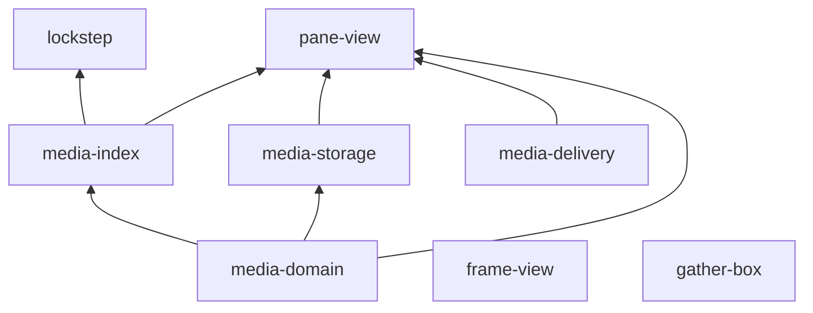

# Code Review: Overall Architecture & Cross-Cutting Concerns

**Date:** 2026-06-12  
**Scope:** Monorepo structure, dependency graph, security posture, testing strategy, CI/tooling

---

## Executive summary

Latch Works is a well-organized pnpm workspace with clear package boundaries and a sensible dependency flow: `media-domain` → `media-index` / `media-storage` / `media-delivery` → apps and tools. The architecture supports the stated goal of a personal media archive with local-first sync. The highest systemic risks are **inconsistent auth enforcement in pane-view**, **the scanArchive unsupported-file bug propagating through the entire sync pipeline**, and **severe test coverage gaps in apps relative to packages**.

---

## Workspace structure

```
latch-works/
├── apps/
│   ├── pane-view/      TanStack Start web viewer (primary product)
│   ├── frame-view/     Electron desktop viewer
│   └── gather-box/     Browser extension collector
├── packages/
│   ├── media-domain/   Shared types, paths, sorting, comics
│   ├── media-index/    Archive scanning, sync planning
│   ├── media-storage/  S3 key layout, client helpers
│   └── media-delivery/ CDN token signing
├── tools/
│   └── lockstep/       CLI sync tool
└── docs/               Decisions, runbooks, plans, analysis
```

### Dependency graph



**Observation:** `frame-view` and `gather-box` do not depend on shared packages. `frame-view` duplicates domain logic; `gather-box` is fully standalone. This creates drift risk as pane-view evolves on shared packages.

**Note:** Root `package.json` references `@latch-works/showcase` in `dev:showcase` script, but no `apps/showcase` directory exists in the workspace. Dead script.

---

## Security posture

### Threat model (implicit)

Single-user private archive. Owner authenticates to pane-view; Lockstep uses a bearer token. CDN tokens grant time-limited access to derivatives. The archive is not multi-tenant.

### Critical security gaps (cross-cutting)

| Issue | Location | Impact |
|-------|----------|--------|
| Unauthenticated library snapshot | pane-view `getLibrarySnapshot` | Full metadata + CDN URL leak |
| Unsupported files indexed as media | media-index `scanArchive` | Non-media uploaded to S3 |
| Arbitrary `objectKey` in sync API | pane-view `complete-object` | S3 key hijacking within bucket |
| No login rate limiting | pane-view login route | Brute-force surface |
| `listFolderChildren` no auth | frame-view IPC | Filesystem enumeration |
| Download URL not allowlisted | gather-box downloader | Cookie-bearing fetch to arbitrary URLs |
| `localFilePath` no containment | lockstep commands | Potential path traversal on push |

### Security strengths

| Area | Implementation |
|------|---------------|
| Credential comparison | `timingSafeEqual` for login and sync tokens |
| Session binding | Owner-only email check rejects foreign sessions |
| CDN tokens | HMAC-SHA256, expiry, constant-time verify |
| Electron defaults | contextIsolation, sandbox, no nodeIntegration |
| SQL queries | Drizzle parameterized; LIKE escaping tested |
| Env validation | `@t3-oss/env-core` with min-length constraints |
| Token storage | Lockstep tokens env-only, never in config files |
| Gather Box permissions | Scoped host permissions, no `<all_urls>` |

### CDN cache vs token TTL mismatch

`CDN_CACHE_CONTROL = "public, max-age=31536000, immutable"` with token TTL of 24h (default). This is a deliberate trade-off for CDN efficiency documented in the Railway runbook, but it means leaked tokens remain usable at the edge after server-side expiry. Operational mitigation: rotate `MEDIA_DELIVERY_SECRET` and purge CDN cache.

---

## Testing strategy

### Current state

| Package/App | Test files | Assessment |
|-------------|-----------|------------|
| media-domain | 2 | Partial (~40% function coverage) |
| media-index | 2 | Critical gap (unsupported-file bug untested) |
| media-storage | 2 | Key layout tested; S3 CRUD untested |
| media-delivery | 2 | Good token coverage |
| pane-view | 1 | **Negligible** (6 test cases) |
| frame-view | 21 | Good main-process coverage; renderer gaps |
| gather-box | 0 | **None** |
| lockstep | 3 | Config/options/progress only; no push tests |

**Total:** 30 test files across the workspace.

### Known CI issues

- `pnpm check` fails on Linux because `apps/frame-view` has a Windows-path unit test (`mediaProtocol.test.ts`).
- `tools/lockstep` tests expect `LOCKSTEP_API_URL` unset for missing-field assertions.
- `pnpm lint` may report pre-existing Biome issues.

### Recommended testing priorities

1. **Auth regression tests for pane-view** — especially `getLibrarySnapshot` rejection.
2. **scanArchive unsupported-file test** — would have caught the highest-impact bug.
3. **Lockstep push integration tests** — mocked API, `maxChanges` ordering.
4. **Gather Box collector fixture tests** — DOM parsing per site.
5. **Sync API validation tests** — sha256, objectKey, mediaType.
6. **CI matrix** — exclude frame-view Windows tests on Linux or use platform-conditional test suites.

---

## Data flow integrity

### Sync pipeline

```
Local archive → scanArchive → createSyncPlan → Lockstep push
  → upload to S3 → complete-object API → PostgreSQL library_entries
```

**Integrity risks:**

1. `scanArchive` indexes unsupported files → non-media in sync plan.
2. `createSyncPlan` false-keep without hashes → stale remote state.
3. `--max-changes` skips deletes → remote has files local deleted.
4. Partial push failures → inconsistent remote state, sync_runs stuck "running".
5. Arbitrary `objectKey` → DB entries pointing at wrong S3 keys.
6. Upload skipped but ingest runs → DB entries with no S3 blob.

### Media delivery pipeline

```
Browser → getLibrarySnapshot (metadata + CDN URLs)
       → resolveMediaDeliveryUrl (auth-checked signed URL)
       → /api/media/:id/thumbnail (session-checked redirect)
       → /cdn/v1/:token (HMAC-verified, no session)
       → S3 object
```

**Integrity risks:**

1. Unauthenticated snapshot embeds CDN URLs (bypasses media API auth).
2. Derivative stuck in `processing` → perpetual 503.
3. Derivative DoS via concurrent generation requests.

---

## Schema drift

Pane View database schema includes tables with no application code:

| Table | Status |
|-------|--------|
| `api_tokens` | Defined; sync uses env var instead |
| `favorites` | Defined; no routes or services |
| `collections` | Defined; no routes or services |
| `viewer_state` | Service defined; not wired to UI |

README claims favorites support; implementation is incomplete. This creates confusion for contributors and inflates migration surface.

---

## Tooling & CI

### Strengths

- pnpm workspace with `blockExoticSubdeps` and explicit `allowBuilds`.
- Biome for lint + format (consistent style).
- Knip for dead code detection (`pnpm knip`).
- `pnpm check` runs build → test → typecheck recursively.
- TypeScript ESM throughout.

### Gaps

- No CI configuration visible in repo (no `.github/workflows/`).
- No pre-commit hooks configured.
- `passWithNoTests` in pane-view and gather-box masks zero-coverage packages.
- Dead `dev:showcase` script in root `package.json`.
- Frame-view Windows test breaks Linux `pnpm check`.

---

## Code duplication

| Duplicated logic | Locations | Risk |
|-----------------|-----------|------|
| Comics/sort utilities | `frame-view/renderer/utils/` vs `media-domain` | Behavioral drift |
| `formatBytes` | `lockstep/progress.ts` vs `media-domain/paths.ts` | Minor |
| Zod schemas | `frame-view/shared/contracts.ts` vs `media-domain/media.ts` | Type drift |
| Path helpers | `frame-view/renderer/utils/path.ts` vs `media-domain/paths.ts` | Behavioral drift |

**Recommendation:** Migrate `frame-view` renderer utils to import from `@latch-works/media-domain`. Add `media-domain` as a frame-view dependency.

---

## Environment & configuration

- Single `.env.example` at repo root with all required keys documented.
- `apps/pane-view/.env` symlinked to root `.env`.
- Lockstep reads from env vars, persists only `source` and `apiUrl` to `~/.latch-works/lockstep.json`.
- No secrets committed (verified `.env.example` uses placeholders).

---

## Recommended systemic improvements

### Immediate (P0)

1. Fix `scanArchive` unsupported-file filter.
2. Add auth to `getLibrarySnapshot`.
3. Ship Gather Box font files.

### Short-term (P1)

4. Shared `requireWebSession()` for all pane-view server fns.
5. Validate `objectKey` in sync API.
6. Fix Lockstep `--max-changes` delete ordering.
7. Add path containment in Lockstep `localFilePath`.
8. Centralize Gather Box URL allowlisting.

### Medium-term (P2)

9. Migrate frame-view to `@latch-works/media-domain`.
10. Build pane-view auth/sync test suite.
11. Add Gather Box Vitest suite.
12. Add CI workflow (Linux, exclude frame-view Windows tests).
13. Clean up unused schema tables or implement features.
14. Add derivative job timeout/reclaim.
15. Login rate limiting.

### Long-term (P3)

16. Multi-token sync auth (use `api_tokens` table).
17. Sync-run completion and manifest JSONL.
18. Implement favorites/collections or remove schema.
19. Wire viewer-state to UI.
20. Platform-conditional test suites for frame-view.
