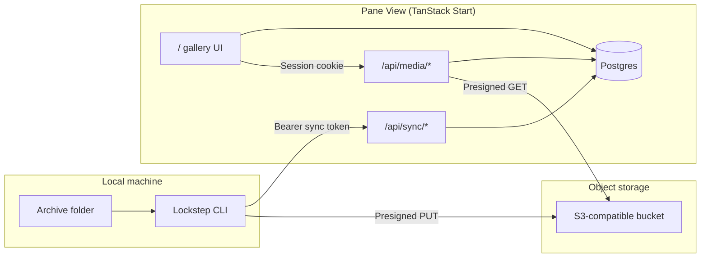
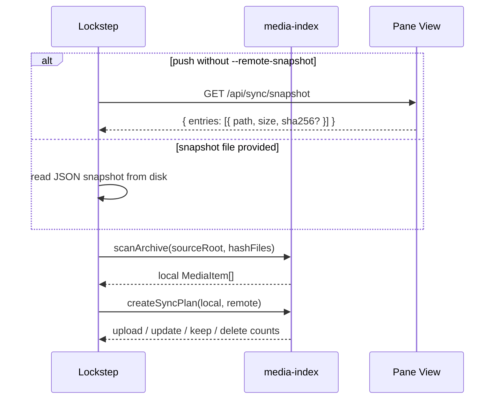
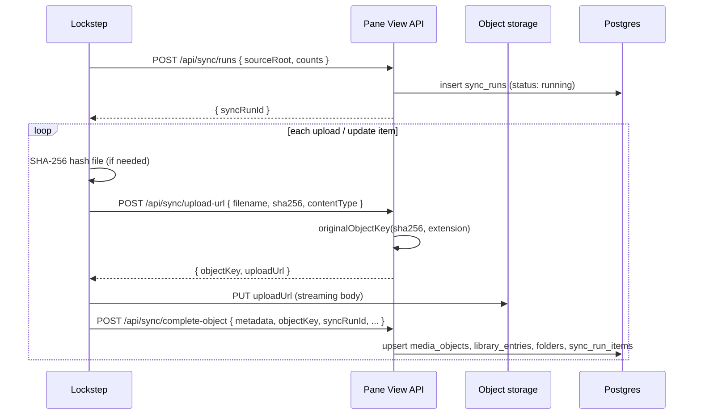
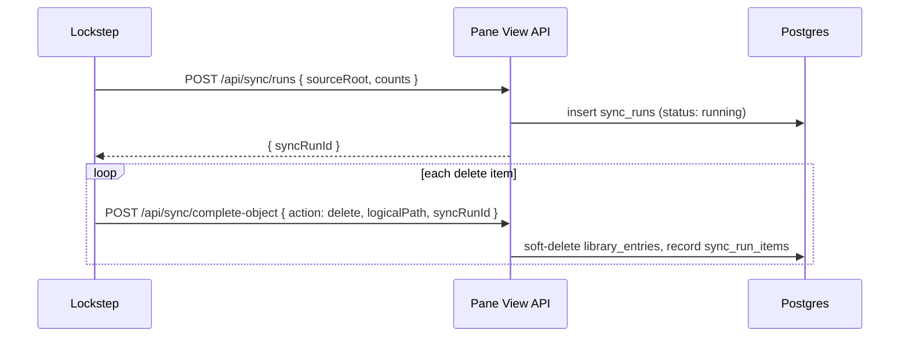
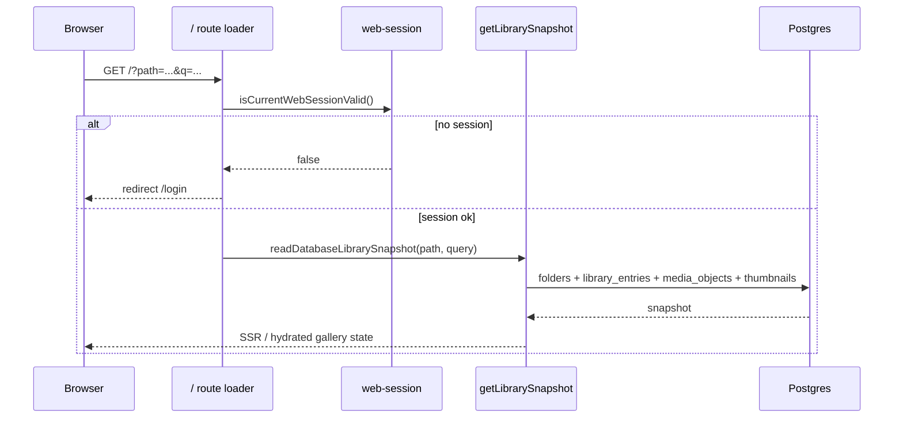
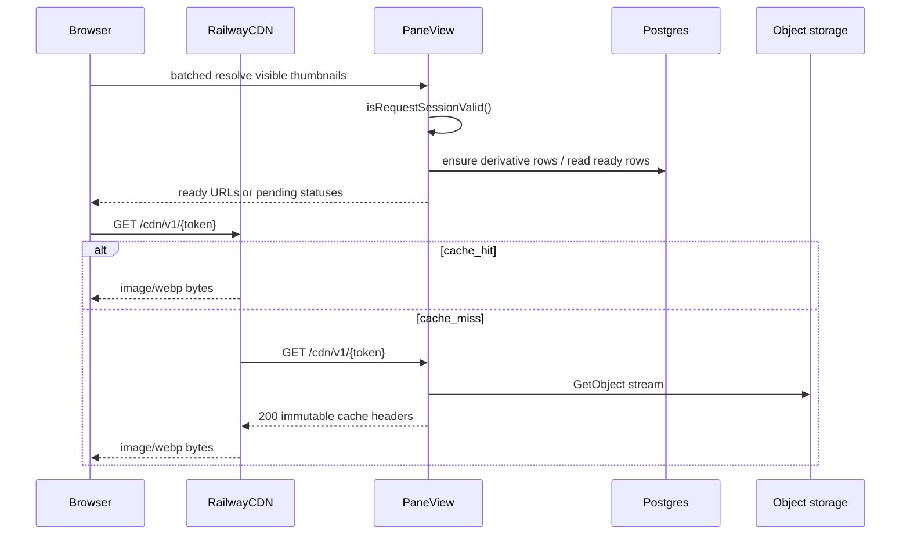

# End-to-End Request Flow

This document describes how media moves from a local archive into Pane View, and how a signed-in user browses that library in the browser. It focuses on the two main actors:

- **Lockstep** — CLI on the laptop that scans the local archive and pushes changes to Pane View.
- **Pane View** — TanStack Start web app that stores catalog metadata in Postgres, originals in S3-compatible object storage, and serves a private gallery UI.

The local archive remains the source of truth. Pane View catalog writes happen through Lockstep sync APIs. The browser UI is read-oriented, with signed-in soft delete available for library entries.

## System map



| Layer | Responsibility |
| --- | --- |
| `@latch-works/media-domain` | Supported extensions, archive paths, sort modes, comic grouping |
| `@latch-works/media-index` | Local scan, hashing, sync plan (upload / update / keep / delete) |
| `@latch-works/media-storage` | Content-addressed object keys (`originals/sha256/...`) |
| `tools/lockstep` | Plan, verify, push commands against Pane View |
| `apps/pane-view` | Auth, sync ingest, library queries, signed media delivery |

## Authentication model

Two separate credentials are intentional: browser sessions never call sync endpoints, and the sync token never grants gallery access.

| Client | Credential | Used for |
| --- | --- | --- |
| Browser | Better Auth session cookie (`HttpOnly`) | `/`, `/login`, `/api/media/*`, server functions |
| Lockstep | `Authorization: Bearer <token>` matching `PANE_VIEW_SYNC_TOKEN` | `/api/sync/*` only |

**Browser login**

1. User submits username/password on `/login`.
2. `POST /api/auth/login` verifies configured owner credentials, then calls Better Auth `sign-in/email`.
3. On success, session cookies are set and the user is redirected to `/`.
4. Protected routes call `isCurrentWebSessionValid()`; invalid sessions redirect to `/login`.

**Sync token**

`requireSyncApiToken()` in `apps/pane-view/src/server/auth/api-token.ts` compares the bearer token to `PANE_VIEW_SYNC_TOKEN` using a constant-time check. Missing or wrong tokens receive `401 Unauthorized`.

---

## Part 1: Lockstep media upload flow

Typical command:

```powershell
$env:LOCKSTEP_API_URL = "https://pane-view.example.com"
$env:LOCKSTEP_API_TOKEN = "<sync-token>"
pnpm start:lockstep -- push --source "D:\Archive"
```

Optional flags: `--remote-snapshot`, `--max-changes`, `--hash`. Remote deletes are applied separately with `prune`. See [runbooks/lockstep.md](./runbooks/lockstep.md).

### Phase A — Plan (local only until push)



**Remote snapshot** (`listRemoteSyncSnapshot` in `apps/pane-view/src/server/sync/store.ts`) reads active `library_entries` joined to `media_objects` (non-deleted). Each entry exposes `path`, `size`, and optional `sha256`.

**Local scan** walks the source tree with the same supported-extension rules as Pane View. When pushing without `--max-changes`, files are hashed so the plan can detect content changes even if size alone matches.

**Sync plan** (`packages/media-index/src/sync-plan.ts`):

| Action | Meaning |
| --- | --- |
| `upload` | Path exists locally but not remotely |
| `update` | Path exists both sides but size or sha256 differs |
| `keep` | Path matches |
| `delete` | Path exists remotely but not locally — planned here; applied by `prune`, not `push` |

`plan` and `verify` stop here. `push` and `prune` continue below as separate phases.

### Phase B — Push (upload / update only)



**1. Start sync run** — `POST /api/sync/runs`

Creates a row in `sync_runs` with `source_root`, optional `counts`, and `status: running`. Returns `syncRunId` used for all items in this push.

**2. Per-file upload** — implemented in `tools/lockstep/src/commands.ts` (`pushMediaItem`)

| Step | Lockstep stage | API / storage |
| --- | --- | --- |
| Hash | `hashing` | Local SHA-256 over file bytes |
| Register | `registering` | `POST /api/sync/upload-url` |
| Upload | `uploading` | `PUT` to presigned URL (direct to bucket, not through Pane View) |
| Ingest | `registering` | `POST /api/sync/complete-object` |

**Upload URL** (`apps/pane-view/src/routes/api.sync/upload-url.ts`):

- Validates sync token.
- Requires `filename` and `sha256`.
- Detects `mediaType` from filename; rejects unsupported types.
- Builds `objectKey` via `originalObjectKey()` — e.g. `originals/sha256/ab/cd/<hash>.jpg`.
- Returns a short-lived presigned PUT URL (default ~300s) for S3-compatible storage.

**Complete object** (`completeSyncedObject` in `apps/pane-view/src/server/sync/store.ts`):

- Upserts `media_objects` on `(sha256, size)` conflict.
- Upserts `library_entries` on `logical_path` (clears `deleted_at` on conflict).
- Walks parent path segments and upserts `folders` for each ancestor.
- Inserts `sync_run_items` with action `upload`.

Logical paths use forward slashes and preserve archive layout (e.g. `sfw/patreon/album/photo.jpg`). They are not the same as object keys: paths are browse metadata; keys are content-addressed storage.

### Phase C — Prune (delete only)

`prune` is a separate Lockstep command. When delete items are present, the CLI prints the paths and requires `--yes` or interactive confirmation before calling the API.



For each delete item, Lockstep posts:

```json
{ "action": "delete", "logicalPath": "...", "syncRunId": "..." }
```

Pane View sets `library_entries.deleted_at` and records a `sync_run_items` row with action `delete`. Remote object bytes are not removed automatically.

### What push does not do yet

- **Guaranteed derivative completion during sync** — in triggered mode Pane View can enqueue prewarm derivative rows after sync completion and wake the media optimizer, but Lockstep does not block push completion on every derivative becoming ready. See [runbooks/pane-view-thumbnails.md](./runbooks/pane-view-thumbnails.md) and [runbooks/media-optimizer.md](./runbooks/media-optimizer.md).
- **Background transcode / PDF covers** — planned as a later worker path in [ARCHITECTURE_PLAN.md](./ARCHITECTURE_PLAN.md).

---

## Part 2: Pane View browse flow

After sync, the owner opens Pane View in a browser. All gallery data comes from Postgres; bytes are fetched only when tiles or the viewer need them.

### Route and URL model

| URL | Role |
| --- | --- |
| `/login` | Password login form |
| `/` | Main gallery (authenticated) |
| `?path=<archive-path>` | Current folder (e.g. `sfw/patreon`) |
| `?q=<query>` | Search across paths and filenames |
| `?media=<library-entry-uuid>` | Selected item (deep link) |

Search params are validated in `apps/pane-view/src/routes/index.tsx` and passed to the route loader.

### Initial page load



**Library snapshot** (`apps/pane-view/src/features/library/library-service.ts` → `readDatabaseLibrarySnapshot`):

- Without `q`: folders where `parent_path = currentPath`; media under `currentPath/` (prefix match on `logical_path`).
- With `q`: case-insensitive match on path/filename for both folders and media.
- Builds `LibraryMediaItem` rows with `thumbnailUrl` when a ready 320px thumbnail exists. Missing ready thumbnails render as placeholders until a bounded batched resolver asks Pane View to enqueue or resolve visible/near-visible derivatives.

The home component (`PaneViewHome`) sorts and filters client-side (recursive mode, comic mode, sort mode), builds `BrowserEntry` list (folders, media, comics), and persists UI preferences via `useGalleryState` (local storage).

### User interactions

| Action | Effect |
| --- | --- |
| Sidebar / breadcrumb / folder tile | `navigate({ search: { path } })` → loader refetch |
| Search submit | `navigate({ search: { path, q } })` |
| Select media tile | Updates selection + `?media=` param |
| Enter / double-click media | Opens `MediaViewerModal` with visible media list |
| Enter on folder | Navigates into folder (`path`) |
| Enter on comic | Opens viewer locked to comic pages |
| Keyboard (gallery) | WASD / arrows move focus; Shift+W parent folder; Shift+S enter folder |
| Keyboard (viewer) | Escape close; arrows / Q-E adjacent item; space play/pause (video) |

Comic mode uses `buildComicEntries` from `@latch-works/media-domain` (same concepts as Frame View): folder-grouped image sequences with numeric filename ordering.

### Media delivery (authenticated)

The browser never receives bucket credentials. Thumbnails use a two-step flow: session-gated authorize routes, then CDN-cacheable signed delivery URLs on Pane View. Originals still redirect to short-lived S3 presigned URLs.



| Endpoint | Auth | Behavior |
| --- | --- | --- |
| `GET /api/media/:mediaId/original` | Session | 302 to S3 presigned GET (~60s) for originals |
| `GET /api/media/:mediaId/thumbnail?size=` | Session | Ensures on-demand derivative, then 302 to `/cdn/v1/{token}`; `503` while generating |
| `GET /cdn/v1/:token` | HMAC token | Streams derivative bytes with long CDN cache headers |

`MediaViewerModal` loads video/image/gif via `/api/media/${id}/original`. Grid tiles use `thumbnailUrl` from the library snapshot (`/cdn/v1/...` when ready). Missing gallery thumbnails are resolved in visible-window batches rather than by every tile polling its own `/api/media/.../thumbnail?size=320` URL.

See [runbooks/pane-view-thumbnails.md](./runbooks/pane-view-thumbnails.md) and [runbooks/railway-cdn-pane-view.md](./runbooks/railway-cdn-pane-view.md).

**Viewer state** (resume position) has server functions `getViewerState` / `saveViewerState` (`apps/pane-view/src/features/viewer/viewer-state-service.ts`) and a `viewer_state` table, but modal wiring is still incomplete. Treat resume persistence as planned rather than a shipped gallery feature.

### Logout

`POST /api/auth/logout` clears the session; subsequent gallery or media requests return `401` or redirect to login.

---

## Data written during a full cycle

```text
Lockstep push / prune
  sync_runs
  sync_run_items
  media_objects      ← sha256-addressed blob metadata (push only)
  library_entries    ← logical_path, filename, parent_path (push upserts; prune soft-deletes)
  folders            ← inferred from path segments (push only)

Pane View browse (read-mostly)
  library_entries + media_objects + thumbnails → gallery snapshot
  sessions           ← browser auth only

Object storage
  originals/sha256/xx/yy/<hash>.<ext>   ← PUT by Lockstep
  thumbnails/...                        ← future; optional today
```

## Related docs

- [runbooks/lockstep.md](./runbooks/lockstep.md) — CLI setup, doctor, verify, push, and prune examples
- [runbooks/pane-view-thumbnails.md](./runbooks/pane-view-thumbnails.md) — thumbnail pipeline plan
- [ARCHITECTURE_PLAN.md](./ARCHITECTURE_PLAN.md) — broader product and schema direction

## Key source files

| Area | Path |
| --- | --- |
| Lockstep push loop | `tools/lockstep/src/commands.ts` |
| Sync plan | `packages/media-index/src/sync-plan.ts` |
| Sync API routes | `apps/pane-view/src/routes/api.sync.*.ts` |
| Ingest store | `apps/pane-view/src/server/sync/store.ts` |
| Gallery route | `apps/pane-view/src/routes/index.tsx` |
| Library query | `apps/pane-view/src/server/library/repository.ts` |
| Media delivery | `apps/pane-view/src/routes/api.media.$mediaId.*.ts` |
| Object key layout | `packages/media-storage/src/index.ts` |
