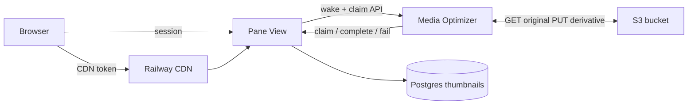
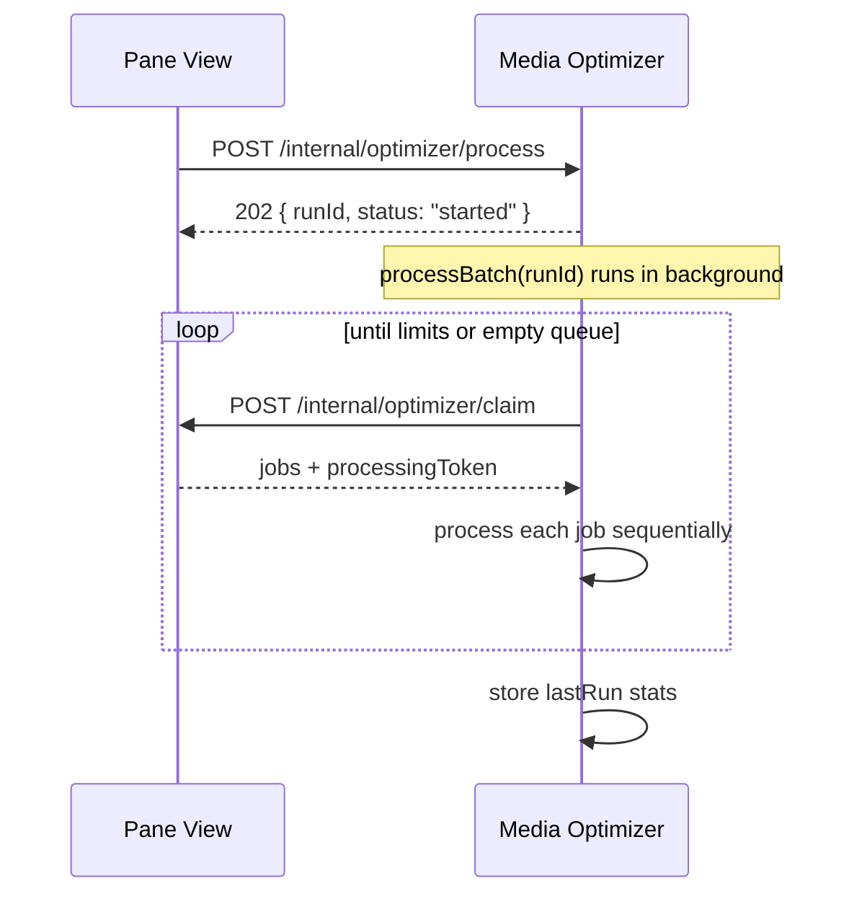
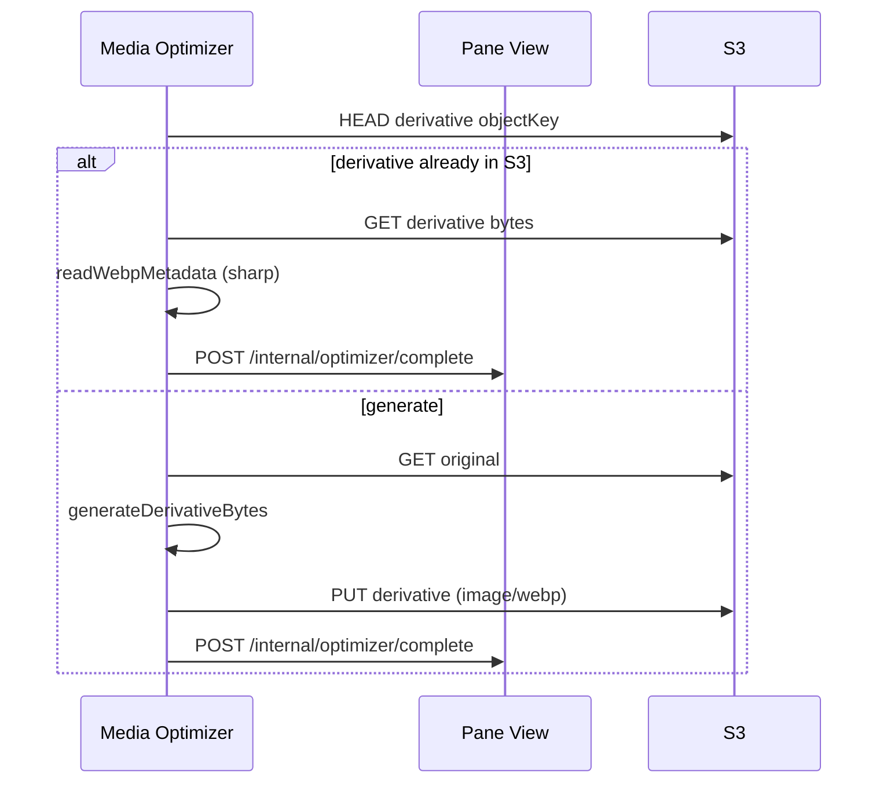

# Media Optimizer Internals

How the media optimizer service works end to end: what triggers a run, how jobs are claimed, how bytes move through S3, and which libraries perform image/video conversion.

For deployment and operations, see [runbooks/media-optimizer.md](./runbooks/media-optimizer.md). For the broader derivative pipeline, see [runbooks/pane-view-thumbnails.md](./runbooks/pane-view-thumbnails.md).

## Mental model

The media optimizer is a **stateless CPU worker**. It does not own a queue or talk to the browser.

| Component | Owns |
| --- | --- |
| **Pane View** | `thumbnails` table (derivative queue), auth, CDN token issuance |
| **Media Optimizer** | CPU-heavy generation only |
| **S3 bucket** | Original and derivative bytes |

The optimizer:

1. Gets woken by Pane View
2. **Claims** jobs over authenticated HTTP
3. Reads **originals** from S3, generates **WebP derivatives**, writes them back to S3
4. **Reports** success or failure to Pane View so the DB row becomes `ready` or `failed`

Generation logic lives in `@latch-works/media-derivatives` (shared with Pane View’s `inline` mode). The optimizer app is mostly orchestration around that package.



---

## What triggers a run?

Pane View wakes the optimizer when derivative rows are `pending` and `DERIVATIVE_PROCESSING_MODE=triggered` (production default on Railway).

### On-demand (gallery browse)

When a user requests a thumbnail that does not exist yet, `ensureThumbnailDerivative` inserts or resets a `pending` row and calls `wakeOptimizer("on-demand")`. Pane View returns `{ status: "pending" }` immediately; the browser polls via batched `resolveMediaDeliveryUrls` until the row is `ready`.

**Source:** `apps/pane-view/src/server/media/derivative-service.ts`

### Post-sync prewarm

After a sync run completes, `prewarmSyncRunDerivatives` enqueues gallery-size (320px) derivatives for newly uploaded or updated image, GIF, and video objects, then wakes the optimizer.

**Source:** `apps/pane-view/src/server/media/derivative-prewarm.ts`

### Wake mechanics

`wakeOptimizer` is fire-and-forget:

- `POST {MEDIA_OPTIMIZER_URL}/internal/optimizer/process`
- `Authorization: Bearer {MEDIA_OPTIMIZER_TOKEN}`
- 4s fetch timeout (optimizer keeps running after timeout)
- 5s cooldown between wakes to prevent stampede from gallery polling

**Source:** `apps/pane-view/src/server/media/optimizer-wake.ts`

---

## HTTP entry point

The optimizer is a small **Hono** app (`apps/media-optimizer`).

| Endpoint | Auth | Behavior |
| --- | --- | --- |
| `GET /health` | None | `{ ok: true, service: "media-optimizer" }` |
| `POST /internal/optimizer/process` | Bearer token | Start background batch; returns `202` |
| `GET /internal/optimizer/status` | Bearer token | `inFlight`, `currentRunId`, `lastRun` counters |

### Single-flight guard

Only one `processBatch` runs at a time. Overlapping `/process` calls return `202 { status: "busy", currentRunId }` without starting a second batch.

**Source:** `apps/media-optimizer/src/server.ts`

### Process lifecycle



---

## Batch loop and limits

`processBatch` (`apps/media-optimizer/src/processor.ts`) drains the queue until:

| Limit | Env var | Default |
| --- | --- | --- |
| Max jobs per wake | `OPTIMIZER_BATCH_LIMIT` | 250 |
| Jobs per claim round | `OPTIMIZER_CLAIM_CHUNK` | 5 |
| Wall-clock budget | `OPTIMIZER_MAX_RUNTIME_MS` | 300000 (5 min) |

Each iteration:

1. `claimJobs(min(remaining, OPTIMIZER_CLAIM_CHUNK))` → Pane View
2. Process jobs **strictly one at a time** (concurrency 1)
3. Stop when queue is empty or any limit is hit

If the runtime budget expires mid-chunk, unprocessed jobs in that chunk are **released** back to `pending` via `POST /internal/optimizer/release`.

---

## Job claiming (Pane View side)

The optimizer calls `POST /internal/optimizer/claim` with `{ limit }`. Pane View runs `claimDerivativeJobs` in a Postgres transaction:

1. `SELECT … FOR UPDATE SKIP LOCKED` on eligible rows:
   - `status = pending` and `next_attempt_at` is due (or null)
   - `status = processing` with expired lease (stale reclaim)
2. `UPDATE` each row → `status = processing`, `processingToken = <uuid>`
3. `JOIN media_objects` and return everything the worker needs

### DerivativeJob payload

| Field | Meaning |
| --- | --- |
| `mediaObjectId` | FK into `media_objects` |
| `originalObjectKey` | S3 key for the original (e.g. `originals/sha256/ab/cd/<hash>.jpg`) |
| `objectKey` | S3 key for the derivative (e.g. `thumbnails/sha256/.../<hash>-320.webp`) |
| `sha256`, `extension`, `mediaType`, `size` | Generation inputs |
| `attemptCount` | Retry counter |

**Lease:** `processingToken` must match on `complete` / `fail` / `release`. Stale `processing` rows are reclaimable after **10 minutes** (`derivativeProcessingLeaseMs`).

**Sources:** `apps/pane-view/src/server/media/derivative-queue.ts`, `apps/pane-view/src/routes/internal.optimizer.claim.ts`

---

## Per-job processing



### Step 1: Idempotency check

Before generating, the optimizer `HEAD`s the derivative key. If the object exists (e.g. a prior run wrote S3 but crashed before `complete`), it reads metadata and calls `complete` without regenerating.

### Step 2: Generate bytes

```typescript
const generated = await generateDerivativeBytes({
  size: snapThumbnailSize(job.size),
  source: {
    extension: job.extension,
    mediaType: job.mediaType,
    originalObjectKey: job.originalObjectKey,
    sha256: job.sha256,
  },
  storage,
});

await putStoredObject({
  body: generated.bytes,
  contentType: "image/webp",
  key: job.objectKey,
  storage,
});
```

**Source:** `apps/media-optimizer/src/processor.ts`

### Step 3: Report completion

`POST /internal/optimizer/complete` with `processingToken`, dimensions, and `objectKey`.

Pane View updates the row only if `processingToken` still matches (compare-and-set). `matched: false` (HTTP 409) means the lease was reclaimed — logged as `optimizer.job_stale_lease`.

### On failure

`POST /internal/optimizer/fail` increments `attemptCount`. Pane View either:

- Reschedules with exponential backoff (`pending`, up to 5 attempts), or
- Marks `failed` permanently

---

## Image and video conversion

All conversion lives in `@latch-works/media-derivatives`:

| Dependency | Role |
| --- | --- |
| **sharp** | EXIF rotate, resize, WebP encode, metadata read |
| **ffmpeg-static** | Extract video poster frame |

Pane View does **not** load sharp/ffmpeg in `triggered` mode. The optimizer bundles them via `media-derivatives`.

### Supported types

`supportsDerivative` returns true for `image`, `gif`, and `video`. PDF is not supported yet.

**Source:** `packages/media-derivatives/src/descriptor.ts`

### Images and GIFs

```text
S3 GetObject (original) → Buffer in RAM (max 512 MiB)
  → sharp(input)
      .rotate()
      .resize(size, size, { fit: "inside", withoutEnlargement: true })
      .webp({ quality: 90 })
  → WebP Buffer
  → S3 PutObject (derivative)
```

**Source:** `packages/media-derivatives/src/generate.ts`, `packages/media-derivatives/src/image.ts`

### Videos

Videos need a temp file because ffmpeg expects a path on disk:

```text
S3 GetObject (stream) → temp file on disk (byte-limited)
  → ffmpeg -ss 1 -i <temp> -frames:v 1 -q:v 2 poster.jpg
  → sharp(poster.jpg) → WebP
  → S3 PutObject to previews/video/sha256/.../<hash>-<size>.webp
  → delete temp dir
```

**Source:** `packages/media-derivatives/src/video.ts`

### Size ladder

Requested sizes snap to the nearest step: **160, 320, 480, 640, 960**.

- Gallery grid default: **320** (`GALLERY_THUMBNAIL_SIZE`)
- Fullscreen preview: **960** (`PREVIEW_DERIVATIVE_SIZE`)

**Source:** `packages/media-delivery/src/thumbnail-size.ts`

---

## S3 object key layout

| Media | Original key | Derivative key |
| --- | --- | --- |
| Image / GIF | `originals/sha256/ab/cd/<hash>.<ext>` | `thumbnails/sha256/ab/cd/<hash>-<size>.webp` |
| Video | `originals/sha256/ab/cd/<hash>.<ext>` | `previews/video/sha256/ab/cd/<hash>-<size>.webp` |

Keys are **content-addressed** (sha256). Folder paths in the archive live only in `library_entries.logical_path`; they are unrelated to S3 keys.

The `objectKey` on each `thumbnails` row is computed at enqueue time via `buildDerivativeDescriptor`.

**Source:** `packages/media-storage/src/index.ts`

Bytes flow **directly** between the optimizer and S3 (AWS SDK). Pane View is not in the data path during generation.

---

## Derivative queue state machine

```text
pending → processing → ready
                    ↘ failed
```

| State | Meaning |
| --- | --- |
| `pending` | Waiting for optimizer claim |
| `processing` | Leased to optimizer (`processingToken` set) |
| `ready` | WebP in S3; browser can get CDN URL |
| `failed` | Generation gave up after max attempts |

In `triggered` mode Pane View **never** runs inline generation — it only enqueues and wakes.

In `inline` mode (local dev default), Pane View generates in-process using the same `generateDerivativeBytes` function; the optimizer is not involved.

---

## After generation: browser delivery

The optimizer does not serve images to users. Once a row is `ready`:

1. Browser calls `resolveMediaDeliveryUrls` (batched server function)
2. Pane View mints an HMAC-signed `/cdn/v1/{token}` URL for the derivative `objectKey`
3. Browser loads the URL; Railway CDN caches the WebP at the edge

See [runbooks/railway-cdn-pane-view.md](./runbooks/railway-cdn-pane-view.md).

---

## Configuration reference

### Media Optimizer (`apps/media-optimizer`)

| Variable | Purpose |
| --- | --- |
| `MEDIA_OPTIMIZER_TOKEN` | Bearer auth for `/internal/*` and Pane View wake |
| `PANE_VIEW_INTERNAL_URL` | Base URL for claim/complete/fail/release |
| `S3_*` | Same bucket as Pane View |
| `OPTIMIZER_BATCH_LIMIT` | Max jobs per `/process` invocation |
| `OPTIMIZER_CLAIM_CHUNK` | Jobs leased per claim round |
| `OPTIMIZER_MAX_RUNTIME_MS` | Wall-clock budget per batch |
| `PORT` / `MEDIA_OPTIMIZER_PORT` | Listen port (default 3200) |

### Pane View (optimizer-related)

| Variable | Purpose |
| --- | --- |
| `DERIVATIVE_PROCESSING_MODE` | `inline` or `triggered` |
| `MEDIA_OPTIMIZER_URL` | Optimizer base URL for wakes |
| `MEDIA_OPTIMIZER_TOKEN` | Shared secret (must match optimizer) |

---

## Observability

The optimizer emits single-line JSON log events:

| Event | When |
| --- | --- |
| `optimizer.process_requested` | `/process` received |
| `optimizer.claim_start` / `claim_complete` | Claim round |
| `optimizer.job_start` / `job_complete` / `job_failed` | Per job |
| `optimizer.job_stale_lease` | Complete rejected (lease mismatch) |
| `optimizer.jobs_released` | Batch timeout released unprocessed jobs |
| `optimizer.batch_complete` | Run finished with counters |
| `optimizer.pane_view_request_failed` | Claim/complete HTTP error |

Pane View logs complementary events (`optimizer.wake_requested`, `optimizer.claim`, `optimizer.complete`, etc.) via `derivative-telemetry.ts`.

---

## Design choices

1. **Queue in Postgres, CPU elsewhere** — Pane View is the source of truth; the optimizer is replaceable.
2. **Concurrency 1 per optimizer instance** — limits sharp/ffmpeg memory spikes. Scale horizontally; claims use `SKIP LOCKED`.
3. **Small claim chunks (5)** — if a batch times out, at most 5 jobs need releasing.
4. **Idempotent S3 writes** — content-addressed keys plus HEAD check make retries safe.
5. **Shared generation library** — `generateDerivativeBytes` is identical in inline and triggered modes; only orchestration differs.

---

## Key source files

| Area | Path |
| --- | --- |
| Optimizer HTTP server | `apps/media-optimizer/src/server.ts` |
| Batch loop and per-job flow | `apps/media-optimizer/src/processor.ts` |
| Pane View HTTP client | `apps/media-optimizer/src/pane-view-client.ts` |
| Wake from Pane View | `apps/pane-view/src/server/media/optimizer-wake.ts` |
| Queue claim/complete/fail | `apps/pane-view/src/server/media/derivative-queue.ts` |
| On-demand enqueue | `apps/pane-view/src/server/media/derivative-service.ts` |
| Post-sync prewarm | `apps/pane-view/src/server/media/derivative-prewarm.ts` |
| Generation (sharp/ffmpeg) | `packages/media-derivatives/src/generate.ts` |
| Image resize | `packages/media-derivatives/src/image.ts` |
| Video poster | `packages/media-derivatives/src/video.ts` |
| S3 helpers | `packages/media-storage/src/s3.ts` |
| Object key conventions | `packages/media-storage/src/index.ts` |

## Related docs

- [runbooks/media-optimizer.md](./runbooks/media-optimizer.md) — deployment, env vars, queue diagnostics
- [runbooks/pane-view-thumbnails.md](./runbooks/pane-view-thumbnails.md) — thumbnail pipeline overview
- [ARCHITECTURE.md](./ARCHITECTURE.md) — full system map
- [derivative-prewarm-and-workers.md](./derivative-prewarm-and-workers.md) — pre-warm strategy options
