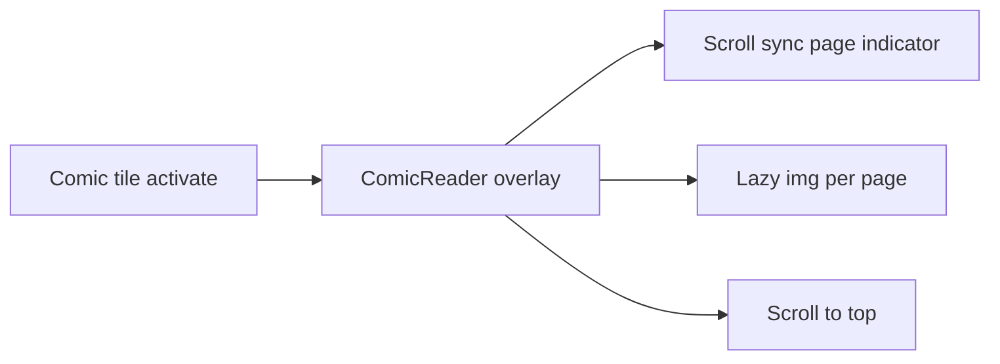
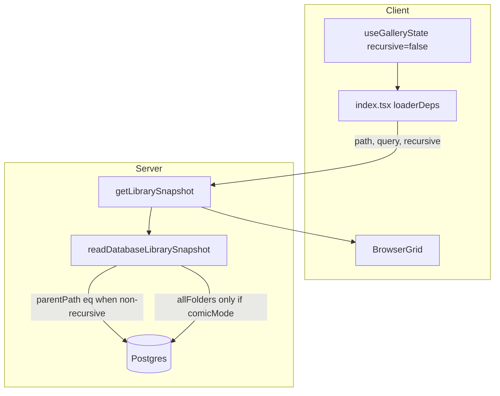

# Pane View Phase 7 — P0, P1, P2 Implementation Plan

## Current state

At commit `719cb21`, **0 of 47 backlog items are fully complete**. Partial groundwork exists only for:

- **P-01**: folder queries use `parentPath` server-side, but media still loads entire archive at root or all descendants in subfolders; client filters in `[index.tsx](apps/pane-view/src/routes/index.tsx)` lines 117–122
- **P-02**: sort/filter/comic grouping still client-side on full payload; no route pending UI
- **S-13**: device-level localStorage in `[useGalleryState.ts](apps/pane-view/src/features/gallery/useGalleryState.ts)` (no per-root map yet)
- **T-02**: static VIDEO badge in `[BrowserEntryCard.tsx](apps/pane-view/src/features/gallery/BrowserEntryCard.tsx)`

Key gaps blocking daily use:

```41:50:apps/pane-view/src/routes/index.tsx
  loaderDeps: ({ search }) => ({
    path: search.path,
    query: search.q,
  }),
```

`recursive` is not in loader deps; `[readDatabaseLibrarySnapshot](apps/pane-view/src/server/library/repository.ts)` has no `recursive` param and always fetches all folders (line 81).

---

## Delivery strategy

Ship in **three PR series** aligned with the backlog sequence. Do not merge S-05 without P-01.


| PR series                     | Scope                                                                  | Branch suggestion                |
| ----------------------------- | ---------------------------------------------------------------------- | -------------------------------- |
| **PR 1 — 7a perf core**       | S-05, P-01, N-04, P-04, P-05, P-02                                     | `cursor/phase-7a-perf-474c`      |
| **PR 2 — 7a UX/mobile**       | T-04, S-01 (minimal), M-01, M-04, M-05, M-10                           | `cursor/phase-7a-mobile-474c`    |
| **PR 3 — 7b settings/viewer** | S-02, S-08–S-11, S-13–S-14, S-10, K-03, K-04                           | `cursor/phase-7b-settings-474c`  |
| **PR 4 — 7b gallery/nav**     | P-03, P-07, P-08, O-04, P-10, P-11, N-01, N-05, D-01, M-08, M-09, T-07 | `cursor/phase-7b-gallery-474c`   |
| **PR 5 — 7b comics**          | C-01 through C-04 (port from Frame View)                               | `cursor/phase-7b-comics-474c`    |
| **PR 6 — 7b viewer a11y**     | V-07, V-09                                                             | (can merge into PR 3/4 if small) |
| **PR 7 — 7c polish**          | M-02, M-07, S-03, T-08, T-02, O-01, O-05                               | `cursor/phase-7c-polish-474c`    |


Each PR ends with `pnpm --filter @latch-works/pane-view check` and manual verification steps from the backlog.

---

## Phase 7a — P0 (13 items)

### 7a.1 — Recursive defaults + correct queries (S-05, P-01, N-04)

**Server**

1. Add `recursive: boolean` to `[library-service.ts](apps/pane-view/src/features/library/library-service.ts)` Zod schema and pass through to repository.
2. In `[repository.ts](apps/pane-view/src/server/library/repository.ts)`:
  - When `recursive: false` and no search query: `eq(libraryEntries.parentPath, currentPath)` for media (replace `ilike` subtree pattern).
  - At archive root with `recursive: false`: still scope media to `parentPath = ""` (fixes unbounded root load).
  - When `recursive: true`: keep subtree `ilike` behaviour for media.
3. Add `recursive` to route `loaderDeps` in `[index.tsx](apps/pane-view/src/routes/index.tsx)`, sourced from persisted gallery state (read at navigation time via search param or loader context — prefer threading through URL/search or a small loader helper that reads the same localStorage key).

**Client**

1. Change default in `[useGalleryState.ts](apps/pane-view/src/features/gallery/useGalleryState.ts)` line 20: `recursive: false`.
2. **N-04**: In `[FloatingToolbar.tsx](apps/pane-view/src/features/gallery/FloatingToolbar.tsx)` + `[index.tsx](apps/pane-view/src/routes/index.tsx)`:
  - Disable recursive toggle when `library.currentPath === ""`.
  - Auto-set `recursive: false` when navigating to archive root.
  - Comic mode may still force effective recursive internally, but toggle stays disabled at root.
3. Remove client-side `visibleMedia` parent filter once server returns correct rows.

**Tests**: Add Vitest unit tests for `readDatabaseLibrarySnapshot` query conditions (mock DB or extract condition builder).

---

### 7a.2 — Smaller folder fetch + indexes (P-04, P-05)

**P-04 — Conditional `allFolders`**

- Add `includeAllFolders: boolean` to repository/service (true when comic mode active).
- Default path: return `folders` (direct children) + ancestor chain for breadcrumbs/sidebar only.
- Skip full-table `db.select().from(folders)` unless comic grouping needs it (`[index.tsx](apps/pane-view/src/routes/index.tsx)` line 129).

**P-05 — Index audit**

Current schema (`[schema.ts](apps/pane-view/src/server/db/schema.ts)`):


| Column                                     | Status                                   |
| ------------------------------------------ | ---------------------------------------- |
| `folders.parentPath`                       | indexed                                  |
| `library_entries.parentPath`               | indexed                                  |
| `library_entries.logicalPath`              | unique only                              |
| `deletedAt` on folders/entries             | **no index**                             |
| `thumbnails (mediaObjectId, size, status)` | PK only; join filters `status = 'ready'` |


Actions:

1. Add partial indexes if audit confirms slow plans: `(parent_path) WHERE deleted_at IS NULL`, composite `(media_object_id, size, status)` on thumbnails.
2. Generate Drizzle migration via `pnpm --filter @latch-works/pane-view db:generate`.
3. Document findings in PR description (no new markdown file unless requested).

---

### 7a.3 — Loading UI + server wins (P-02)

1. Add `pendingComponent` on `[index.tsx](apps/pane-view/src/routes/index.tsx)` route (or `defaultPendingComponent` on `[__root.tsx](apps/pane-view/src/routes/__root.tsx)`) using existing `[Skeleton](apps/pane-view/src/components/ui/skeleton.tsx)` for grid/header placeholders.
2. Move cheap server-side work into repository after P-01:
  - Pass `sortMode` + `randomSeed` to loader when feasible, or at minimum sort in SQL for name/date modes.
  - Keep random sort client-side (needs seed).
3. Remove redundant client sorts once server returns ordered rows.

---

### 7a.4 — Thumbnail pending UX (T-04)

Enhance `[Poster.tsx](apps/pane-view/src/features/gallery/Poster.tsx)`:

1. Wrap `` with loading state: `Skeleton` pulse until `onLoad`.
2. On `onError` / fetch of 503 from `[api.media.$mediaId.thumbnail.ts](apps/pane-view/src/routes/api.media.$mediaId.thumbnail.ts)`: respect `Retry-After: 1`, retry with backoff cap.
3. Consider a small `useThumbnailUrl` hook (fetch + retry) rather than raw `` when URL may 503.

---

### 7a.5 — Settings shell minimal (S-01)

New feature module `apps/pane-view/src/features/settings/`:

- **Entry**: gear button in header or `[FloatingToolbar.tsx](apps/pane-view/src/features/gallery/FloatingToolbar.tsx)` opens shadcn `[Sheet](apps/pane-view/src/components/ui/sheet.tsx)` (drawer pattern; no `/settings` route required initially).
- **Usability tab**: recursive default toggle (writes `useGalleryState`), placeholders for P1 toggles.
- Model after Frame View `[SettingsDrawer.tsx](apps/frame-view/src/renderer/components/SettingsDrawer.tsx)` structure but web-native (Sheet, no Electron IPC).

Extend `[useGalleryState.ts](apps/pane-view/src/features/gallery/useGalleryState.ts)` with a `settings` blob or separate `useAppSettings.ts` for viewer/theme prefs (P1 will fill in).

---

### 7a.6 — Mobile single-tap (M-01)

In `[BrowserEntryCard.tsx](apps/pane-view/src/features/gallery/BrowserEntryCard.tsx)`:

- Use `[useIsMobile](apps/pane-view/src/hooks/use-mobile.ts)`.
- Mobile: `onClick` → `onActivate`; desktop: keep select-on-click, activate-on-double-click.

---

### 7a.7 — Mobile viewer layout + tap zones (M-04, M-05)

In `[MediaViewerModal.tsx](apps/pane-view/src/features/gallery/MediaViewerModal.tsx)`:

1. **M-04**: `useIsMobile`; safe-area padding (`env(safe-area-inset-*)`); auto-hide top/bottom chrome on tap; collapse metadata to one line on mobile.
2. **M-05**: Add invisible left/right 50%-width full-height buttons with `aria-label`; hide visible `<` / `>` arrows on mobile (`md:` breakpoint).

---

### 7a.8 — PDF viewer (M-10)

1. Add `pdfjs-dist` dependency to `[package.json](apps/pane-view/package.json)`.
2. Create `PdfViewer.tsx` under `features/viewer/` — canvas/page render, pinch/zoom, page scroll.
3. Replace iframe in `MediaViewerModal` for PDF media type; keep iframe fallback behind feature flag if spike fails.
4. Wire worker from CDN or bundled worker path per PDF.js docs.

**Open decision (use backlog default): PDF.js over iframe.**

---

## Phase 7b — P1 (27 items)

Blocked on **S-01** for most settings items. Group into logical batches:

### Batch B1 — Settings & prefs (S-02, S-08, S-09, S-10, S-11, S-13, S-14, K-03, K-04)


| ID              | Implementation                                                                                                               |
| --------------- | ---------------------------------------------------------------------------------------------------------------------------- |
| **S-02**        | Add `next-themes`; remove hardcoded `dark` on `[__root.tsx](apps/pane-view/src/routes/__root.tsx)`; theme toggle in settings |
| **S-08/S-09**   | `autoPlay` + `loop` on `<video>` in `MediaViewerModal`; toggles in Usability tab                                             |
| **S-10**        | Loop viewer `step()` when setting on; **default: on** (Frame View parity)                                                    |
| **S-11**        | `showImages` / `showVideos` filters; client filter on loader results short-term                                              |
| **S-13**        | Per-root prefs map in localStorage keyed by `currentPath` root segment; merge with device defaults                           |
| **S-14 / K-04** | Hotkeys tab in settings + `?` overlay sheet listing same content                                                             |
| **K-03**        | Guard global key handlers in `index.tsx` when settings/overlay open                                                          |


Reference Frame View: `[UsabilityTab](apps/frame-view/src/renderer/components/settings/UsabilityTab.tsx)`, `[HotkeysTab](apps/frame-view/src/renderer/components/settings/HotkeysTab.tsx)`.

---

### Batch B2 — Search & thumbnails (P-03, P-07, P-08, O-04, S-03 partial)


| ID       | Implementation                                                                                                                                                                                                                                                                       |
| -------- | ------------------------------------------------------------------------------------------------------------------------------------------------------------------------------------------------------------------------------------------------------------------------------------ |
| **P-03** | Paginated search: add `limit` + `cursor` to repository ILIKE queries; "Load more" or infinite scroll in search results                                                                                                                                                               |
| **P-07** | Compute `round(cardWidth × DPR)` in `[BrowserGrid.tsx](apps/pane-view/src/features/gallery/BrowserGrid.tsx)` / `[useVirtualGridMetrics.ts](apps/pane-view/src/features/gallery/useVirtualGridMetrics.ts)`; pass `?size=` to thumbnail URLs; snap to ladder from `derivative-service` |
| **P-08** | `IntersectionObserver` on visible `Poster` rows; set `fetchPriority="high"` for in-viewport items                                                                                                                                                                                    |
| **O-04** | AbortController per thumb fetch; cancel on scroll-away (pairs with P-08)                                                                                                                                                                                                             |
| **P-11** | Prefetch adjacent viewer item preview/thumb on step                                                                                                                                                                                                                                  |


**S-03** (P2) threads through same sizing helper — implement helper in B2, expose slider in 7c.

---

### Batch B3 — Viewer upgrades (P-10, V-07, V-09)


| ID       | Implementation                                                                                                                                                                                                                          |
| -------- | --------------------------------------------------------------------------------------------------------------------------------------------------------------------------------------------------------------------------------------- |
| **P-10** | New `/api/media/:id/preview` route using existing `previewObjectKey` in `[derivative-service.ts](apps/pane-view/src/server/media/derivative-service.ts)`; viewer loads preview by default; "View original" button triggers original URL |
| **V-07** | Copy path + download actions in viewer toolbar and detail panel                                                                                                                                                                         |
| **V-09** | Focus trap on modal open; restore focus on close; `aria-label` on prev/next/close                                                                                                                                                       |


---

### Batch B4 — Navigation & IA (N-01, N-05, M-08, M-09, D-01, T-07)


| ID       | Implementation                                                                                                                                 |
| -------- | ---------------------------------------------------------------------------------------------------------------------------------------------- |
| **N-01** | Parent/sibling buttons in `[BrowserHeader](apps/pane-view/src/features/gallery/BrowserHeader.tsx)` or header area (keyboard already exists)    |
| **N-05** | Spinner/disabled state on refresh button during `router.isLoading` / invalidation                                                              |
| **M-08** | Larger sidebar touch targets on mobile; stronger hover/active in `ArchiveSidebar`                                                              |
| **M-09** | Move logout/account to sidebar footer; center toolbar = browse controls only                                                                   |
| **D-01** | Extend `[DetailPanel.tsx](apps/pane-view/src/features/gallery/DetailPanel.tsx)` with size, dimensions, duration, mtime from `LibraryMediaItem` |
| **T-07** | Wrap `moveGridFocus` at grid edges (match Frame View)                                                                                          |


---

### Batch B5 — Comic reader port (C-01, C-02, C-03, C-04)

Port `[ComicReader.tsx](apps/frame-view/src/renderer/components/ComicReader.tsx)` to pane-view:

1. New `apps/pane-view/src/features/comics/ComicReader.tsx`.
2. Adapt page URLs to `/api/media/:id/original` or preview (not `file://`).
3. Wire `handleActivateEntry` for comic kind to open `ComicReader` overlay instead of paginated `MediaViewerModal`.
4. Includes scroll-synced indicator (C-02), lazy pages (C-03), scroll-to-top (C-04).




---

## Phase 7c — P2 (7 items)


| ID       | Implementation                                                                                                                                                          |
| -------- | ----------------------------------------------------------------------------------------------------------------------------------------------------------------------- |
| **M-02** | Search icon on mobile opens Sheet with search form (hidden `md:flex` form today)                                                                                        |
| **M-07** | Mobile header: primary folder name, optional parent line, path sheet on tap, parent chevron (see [clarifications doc](docs/analysis/pane-view-issue-clarifications.md)) |
| **S-03** | Thumbnail size slider in settings; feeds P-07 sizing helper                                                                                                             |
| **T-08** | Spike animated WebP derivative for GIFs in sync pipeline; fallback to current behaviour                                                                                 |
| **T-02** | VIDEO badge already partial; polish styling only (live hover preview is T-01 backlog)                                                                                   |
| **O-01** | Diagnostics JSON export in settings Debug tab (adapt Frame View `[DebugTab](apps/frame-view/src/renderer/components/settings/DebugTab.tsx)`)                            |
| **O-05** | Confirm dialogs for any destructive admin actions added in O-01                                                                                                         |


---

## Architecture after P0




---

## Verification checklist

**P0 exit criteria** (from backlog):

- [ ] Folder with 10k descendants in non-recursive mode returns only direct children
- [ ] Archive root loads in bounded time; recursive toggle disabled
- [ ] Navigation shows pending/skeleton UI
- [ ] Thumbs pulse while generating; 503 retries
- [ ] Mobile: one tap opens; viewer tap zones work; PDF readable

**P1/P2**: Per-item acceptance in clarifications doc (P-07 sharp thumbs on 2× DPR, P-10 preview-first, M-07 readable folder name at 390px, etc.).

Run before each PR: `pnpm --filter @latch-works/pane-view check`.

---

## Open decisions (using backlog defaults)


| ID       | Decision                                 |
| -------- | ---------------------------------------- |
| **S-10** | Loop viewer navigation default **on**    |
| **M-10** | **PDF.js** for mobile PDF control        |
| **P-10** | **Button** to load original; pinch later |


No blockers — proceed with these defaults unless you prefer otherwise.