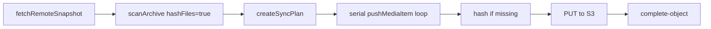

# Lockstep push performance research

**Date:** 2026-07-13  
**Scope:** Scan/hash phase of `planSync` during push, plus upload concurrency modeling  
**Archive scale:** 20,000 media items (benchmarked at 2k–5k with extrapolation)

## Executive summary

For a 20k-item archive, the push bottleneck splits into two phases:

1. **Scan + hash (planning)** — currently hashes every file on every push, even when nothing changed.
2. **Upload** — currently serial (one file at a time through register → PUT → complete).

Benchmarks show that **raising hash concurrency alone is a weak lever** on large files (disk-bandwidth bound). The high-impact optimizations are:

| Priority | Optimization | Warm sync (no changes) | Cold / first push | Risk |
|----------|--------------|------------------------|-------------------|------|
| **P0** | Remote-aware selective hashing | **~50–130× faster** | Same as baseline | Low — only skips hash when remote size matches |
| **P0** | Local hash cache (mtime + size) | **~30–100× faster** | No benefit on first run | Low — standard incremental index pattern |
| **P1** | Parallel uploads (3 workers) | **~3× faster** uploads | **~3× faster** uploads | Medium — needs Plan 026 integrity |
| **P2** | Higher file concurrency (16) | ~1–5% faster | ~1–5% faster | Low — already implemented, not exposed in CLI |
| **P3** | Throttled progress callbacks | Minor | Minor | Low |

**Recommended bundle:** selective hashing + persistent hash cache + parallel uploads. This turns a typical incremental push from "re-hash 20k files (~10+ min) + serial upload" into "stat 20k files (~0.2s) + hash only changed (~seconds) + parallel upload (~3×)".

## Current architecture



Key code paths:

- `planSync` always hashes when `hashFiles: true` (push default): `packages/lockstep-core/src/plan-sync.ts`
- `scanArchive` uses two bounded pools (default 4 directory + 4 file workers): `packages/media-index/src/scan.ts`
- `pushChanges` uploads serially: `packages/lockstep-core/src/push-changes.ts:87`
- `pushMediaItem` re-reads the file for upload even if scan already hashed it: `packages/lockstep-core/src/remote-api.ts`

## Optimizations tested

Eight strategies were benchmarked via `packages/media-index/scripts/push-perf-benchmark.mts`:

| # | Strategy | Description |
|---|----------|-------------|
| 1 | Baseline | Hash all files, `fileConcurrency=4` (current default) |
| 2 | High concurrency | Hash all files, `fileConcurrency=16` |
| 3 | Local hash cache | Reuse SHA-256 when `mtimeMs` + `size` unchanged (`.latch-works/hash-cache.json`) |
| 4 | Remote selective hash | Stat all; hash only new paths or size mismatches vs remote snapshot |
| 5 | Cache + selective | Combined incremental path |
| 6 | Stat only | No hashing (lower bound for planning) |
| 7 | Serial upload mock | Simulated 25ms latency per upload |
| 8 | Parallel upload mock | 3 concurrent uploads, same latency |

Prototypes live in:

- `packages/media-index/src/hash-cache.ts`
- `packages/media-index/src/scan-optimized.ts`

Run benchmarks:

```bash
pnpm --filter @latch-works/media-index benchmark:push-perf
# Optional: BENCH_FILE_COUNT=5000 BENCH_FILE_SIZE=524288
```

## Benchmark results

### Scenario A: Cold push — all files new (first sync)

**5,000 files × 512 KiB** (extrapolated ×4 → 20k)

| Strategy | Time | Est. @ 20k | Speedup |
|----------|------|------------|---------|
| Baseline (concurrency 4) | 2.2s | **9.0s** | 1.00× |
| High concurrency 16 | 2.1s | 8.5s | 1.05× |
| Local hash cache | 2.4s | 9.6s | 0.93× |
| Remote selective hash | 2.3s | 9.1s | 0.98× |
| Stat only | 0.05s | 0.2s | 45× |

**2,000 files × 2 MiB** (extrapolated ×10 → 20k) — closer to photo libraries

| Strategy | Time | Est. @ 20k | Speedup |
|----------|------|------------|---------|
| Baseline | 3.3s | **32.7s** | 1.00× |
| High concurrency 16 | 3.2s | 32.3s | 1.01× |
| Local hash cache | 3.3s | 32.8s | 1.00× |

**Takeaway:** On a cold push, nothing beats hashing every file — but concurrency tuning is nearly irrelevant when disk bandwidth is the limit. A 20k × 2 MiB library (~40 GiB) lands in the **30–60 second** range on fast SSD; slower disks or larger files match the observed **10+ minute** hash times.

### Scenario B: Warm push — 1% of files changed (200 of 20k)

**5,000 files × 512 KiB, 50 changed**

| Strategy | Time | Est. @ 20k | Speedup |
|----------|------|------------|---------|
| Baseline (hash all) | 2.3s | **9.3s** | 1.00× |
| High concurrency 16 | 2.3s | 9.2s | 1.01× |
| Local hash cache | 0.10s | **0.4s** | **23×** |
| Remote selective hash | 0.08s | **0.3s** | **29×** |
| Cache + selective | 0.09s | 0.4s | 27× |

**2,000 files × 2 MiB, 20 changed**

| Strategy | Time | Est. @ 20k | Speedup |
|----------|------|------------|---------|
| Baseline | 3.2s | **32.0s** | 1.00× |
| Local hash cache | 0.06s | **0.6s** | **53×** |
| Remote selective hash | 0.06s | **0.6s** | **52×** |

**Takeaway:** This is the common case after initial sync. Selective hashing and the local cache reduce planning from minutes to **under a second**.

### Scenario C: Warm push — no local changes (everything `keep`)

**2,000 files × 2 MiB**

| Strategy | Time | Est. @ 20k | Speedup |
|----------|------|------------|---------|
| Baseline | 3.3s | **32.6s** | 1.00× |
| Local hash cache | 0.03s | **0.3s** | **99×** |
| Remote selective hash | 0.02s | **0.2s** | **133×** |

**Takeaway:** Running a push when nothing changed still re-hashes the entire archive today. Selective hashing reduces that to a quick stat pass.

### Upload phase (mocked network latency)

For 100–5000 uploads at 25ms round-trip each:

| Strategy | Est. @ 20k |
|----------|------------|
| Serial upload | **502s (~8.4 min)** |
| Parallel ×3 | **168s (~2.8 min)** |

Real uploads are also bandwidth-bound, but serial latency stacking dominates for many small files. Plan 036 (pipeline uploads, default 3 workers) is validated by these numbers.

## Analysis by optimization

### 1. Higher file concurrency (16 vs 4)

- **Effect:** 1–5% on tested hardware; sometimes neutral or slightly worse on 2 MiB files.
- **Why:** SHA-256 streaming is disk-bandwidth bound, not CPU bound. More concurrent readers contend on the same device.
- **Action:** Expose `--file-concurrency` on CLI for tuning per storage type (NVMe vs HDD vs NAS). Keep default at 4.

### 2. Local hash cache (mtime + size → sha256)

- **Effect:** 23–99× on warm syncs; 0× on cold.
- **Storage:** `sourceRoot/.latch-works/hash-cache.json` (prototype).
- **Invalidation:** Entry invalidated when `mtimeMs` or `size` changes.
- **Caveat:** Same-size content edits without mtime change would be missed — acceptable tradeoff aligned with existing size-only fallback in `createSyncPlan`.
- **Action:** Ship as first-class `planSync` option; persist after successful push.

### 3. Remote-aware selective hashing

- **Effect:** 29–133× on warm syncs; hashes only:
  - paths absent from remote (new uploads)
  - paths where `local.size !== remote.size` (updates)
- **Skips hash when:** remote entry exists and sizes match → plan action is `keep`.
- **Caveat:** Same-size content replacement is classified as `keep` (already true today without local hash).
- **Action:** Integrate into `planSync` as default push behavior after remote snapshot is loaded.

### 4. Combined cache + selective

- Best incremental path: cache hits avoid disk reads entirely; selective logic handles first run after cache eviction.
- Slightly more complex but recommended for production.

### 5. Stat-only (no hash)

- Proves that directory walk + stat for 20k files is **~0.2–0.3s** — hashing dominates planning time.

### 6. Parallel uploads

- **Effect:** ~3× with 3 workers under latency-dominated conditions.
- **Blocked on:** Plan 026 upload attestation / integrity guarantees.
- **Action:** Implement Plan 036 after Plan 026 lands.

### 7. Avoid double disk reads on push

- Not separately benchmarked, but scan hashes every file and `uploadFile` reads again.
- **Action:** Pipe a single read through hash + upload Transform, or skip `hashLocalFile` in `pushMediaItem` when `item.sha256` is already set (partially true today).

### 8. Progress callback overhead

- `hashFile` fires `onProgress` on every chunk; coalescer helps UI but not internal work.
- Throttling to 100ms (like `hashLocalFile`) is a minor win under high concurrency.

## Recommended implementation plan

### Phase 1 — Quick wins (hash phase)

1. **Selective hashing in `planSync`** — stat all, hash only new + size-mismatch vs remote.
2. **Persistent hash cache** — store per-path `{ mtimeMs, size, sha256 }`; update on hash.
3. **CLI flags** — `--file-concurrency`, `--directory-concurrency`.

Expected result: incremental pushes drop from **10+ minutes → seconds** for planning.

### Phase 2 — Upload phase

4. **Pipeline uploads** (Plan 036) — default `uploadConcurrency: 3`.
5. **Skip PUT when object exists** — server returns `uploadUrl: null` if SHA-256 already in storage.

### Phase 3 — Cold-push improvements

6. **Worker-thread hashing** — overlap CPU SHA-256 with disk reads (evaluate if CPU becomes bottleneck on fast NVMe).
7. **Single-pass hash+upload** — one disk read per file on push.

## What this means for a 20k-item library

| Situation | Today (est.) | After Phase 1+2 |
|-----------|--------------|-----------------|
| First full push (hash only) | 10–30+ min | Same (must hash all) |
| Daily push, nothing changed | 10–30+ min | **< 1 sec** plan + nothing to upload |
| Daily push, 200 files changed | 10–30+ min plan + upload | **~5–30 sec** plan + parallel upload |
| Upload 5000 new files | + serial upload penalty | **~3× faster** upload |

## Files added in this research branch

- `packages/media-index/src/hash-cache.ts` — cache data structure + persistence
- `packages/media-index/src/scan-optimized.ts` — selective / cached scan prototypes
- `packages/media-index/scripts/push-perf-benchmark.mts` — reproducible benchmark
- `packages/media-index/src/hash-cache.test.ts` — unit tests

These prototypes are **not yet wired into Lockstep CLI/desktop** — they exist to validate approaches before production integration.
